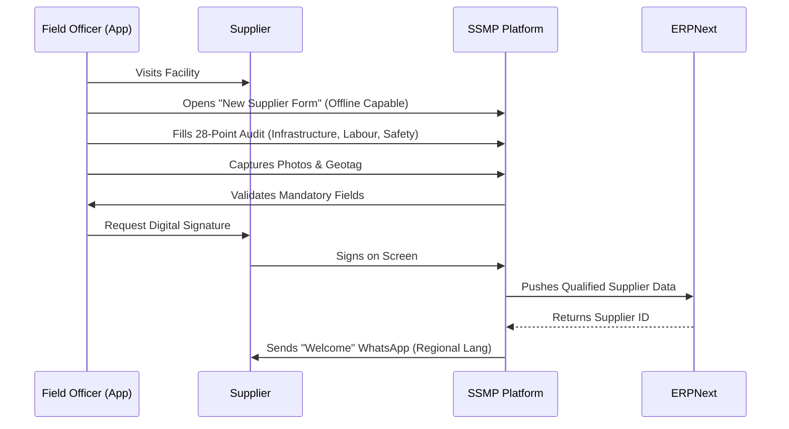
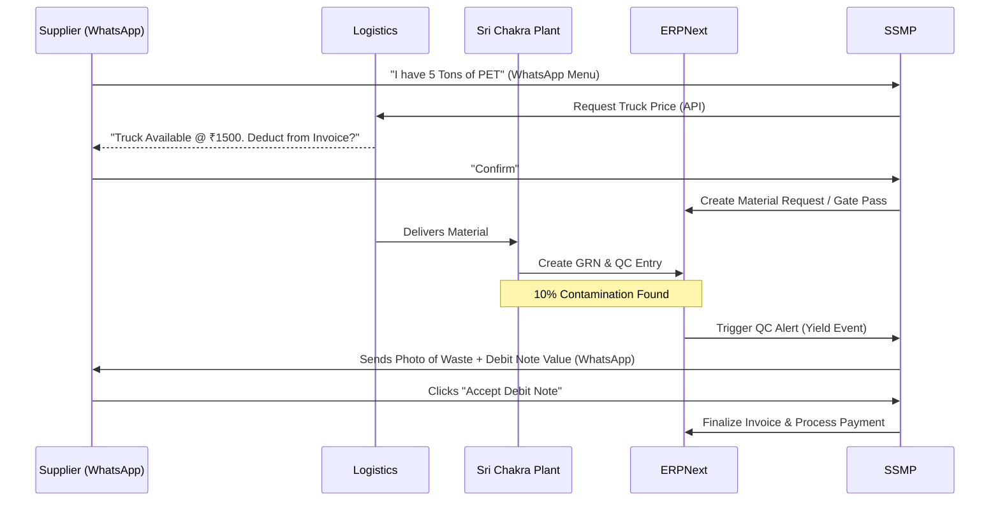
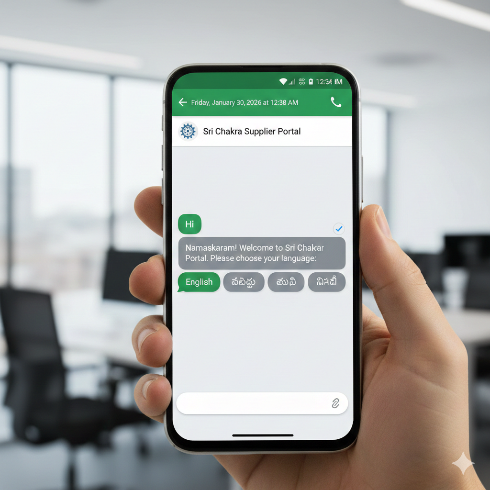
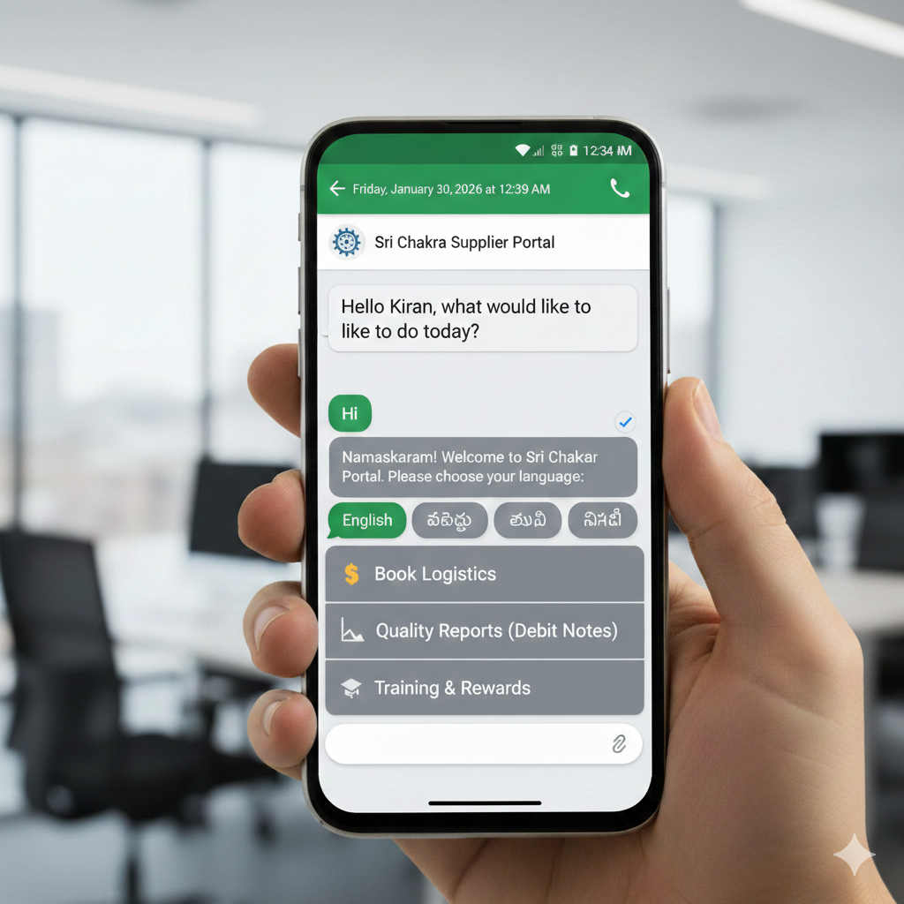
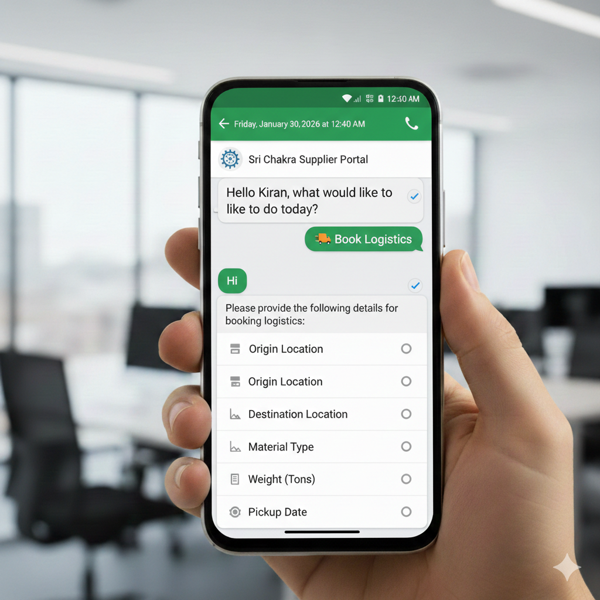
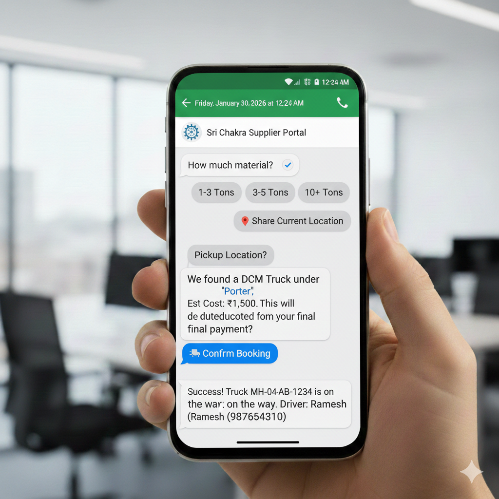
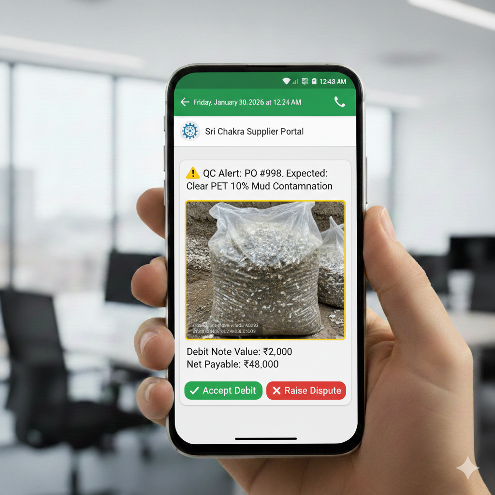
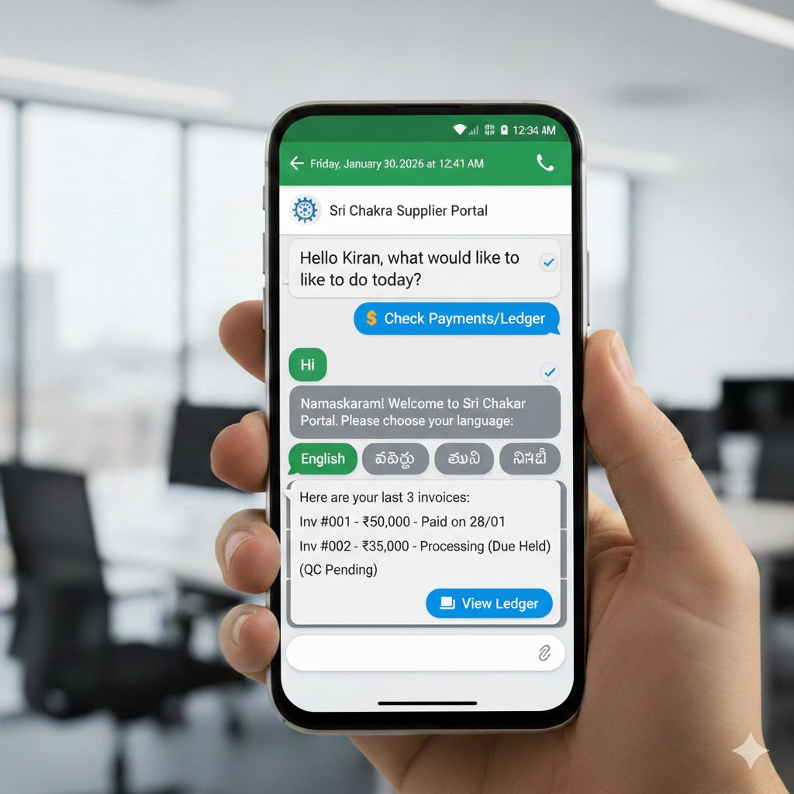
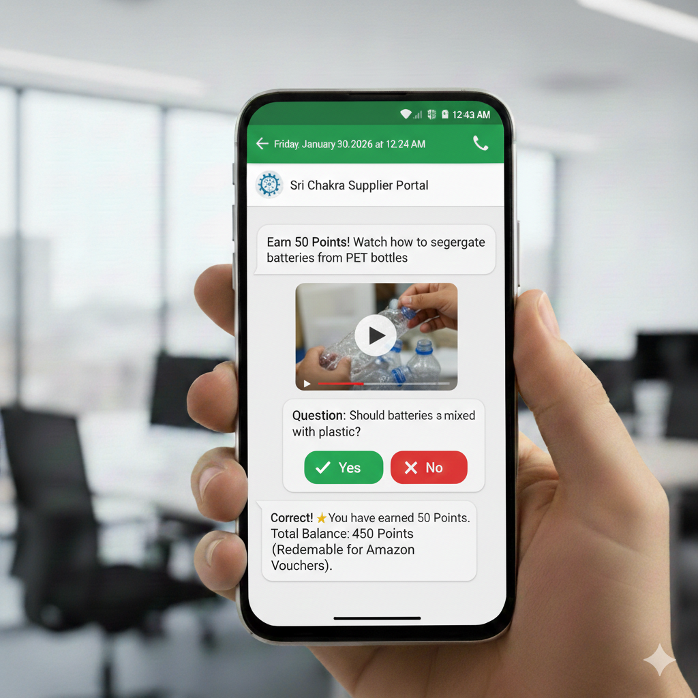

# Sri Chakra Supplier Management Program (SSMP) - Walkthrough

**Goal:** To digitize and streamline the backward integration supply chain for Sri Chakra, enabling seamless onboarding, engagement, and transactions with an unorganized, multilingual vendor community while ensuring full traceability and ERP integration.

---

## 2. Understanding the Problem & Context

Sri Chakra is moving towards **backward integration**—directly managing waste collection and aggregation. This shift introduces specific challenges that standard ERPs cannot handle alone.

### Key Challenges

1. **Unorganized Supplier Base:** Vendors are often semi-literate, non-technical, and operate informally. They will not install or update complex mobile apps.
2. **Language Barriers:** Operations span multiple states (Telangana/Andhra, Tamil Nadu, etc.), requiring deep multilingual support (Telugu, Tamil, Hindi, English).
3. **Trust Deficit in Quality Control (QC):** Disputes arise when debit notes are issued for contamination (mud/metal) without immediate proof and acceptance.
4. **EPR & Traceability Compliance:** New regulations require tracking not just _who_ supplied the material, but _where_ they got it (Tier 2/3 traceability).
5. **Rigid Processes vs. Dynamic Needs:** Evaluation questionnaires (currently ~28 questions) change frequently. Hard-coding them creates bottlenecks.

---

## 3. Defining the Entities

| Entity                     | Role & Responsibility                                                                            | Primary Interface       |
| :------------------------- | :----------------------------------------------------------------------------------------------- | :---------------------- |
| **Supplier (Tier 1)**      | Aggregates waste, manages bookings, receives payments. Needs low-friction interaction.           | **WhatsApp Bot**        |
| **Sub-Supplier (Tier 2+)** | Small waste pickers/aggregators feeding Tier 1. Source of traceability data.                     | Verified Tag / WhatsApp |
| **Field Officer**          | Sri Chakra's "Boots on the Ground". Onboards suppliers, conducts audits, verifies sub-suppliers. | **Mobile App**          |
| **Center Ops / QC**        | Receives material, checks quality, determines contamination % (Debit Note trigger).              | ERPNext / Internal App  |
| **Admin / Procurement**    | Managing plans, audit schedules, form configs, and overall strategy.                             | **Web Dashboard**       |
| **ERPNext**                | Single Source of Truth for *financials* (Ledger, POs, Invoices, Payments).                       | Backend / API           |

---

## 4. Operational Workflows (Use Cases)

### A. Supplier Onboarding Journey

### B. Transaction & QC Loop

---

## 5. The Solution Strategy: "WhatsApp-First"

To bridge the gap between a sophisticated ERP and an unorganized workforce, we propose a **Hybrid Architecture**:

1. **The Engagement Layer (SSMP):** Handles all "Soft" data (Surveys, Training, Chats, Logs) and acts as the friendly face.
2. **The Transaction Layer (ERPNext):** Remains the distinct master for "Hard" data (Finance, Inventory).

### Why this approach?

- **No App Fatigue:** Suppliers use the tool they already have—WhatsApp.
- **Agility:** Admin teams can change survey questions in SSMP without deploying code or touching the complex ERP structure.
- **Compliance:** Digital consent and audit trails are baked into the engagement layer.

---

## 6. Solution Walkthrough (The "Demo")

This section details the user experience for the three critical interfaces.

### A. Supplier Experience (The WhatsApp Bot)

_Concept: "Zero Friction, Chat-Based ERP Interface"_

1. **Onboarding & Language Selection**
   - **Trigger:** Supplier receives a welcome message after Field Officer registration.
   - **Bot:** "Namaskaram! Welcome to Sri Chakra. Please choose your language:"
   - **Action:** Supplier selects `Telugu`. All future menus, alerts, and PDF statements are instantly localized.

   

2. **The centralized "Main Menu"**
   - Instead of navigating complex screens, the supplier sees simple list options:
     - 💰 **Check Payments/Ledger**
     - 🚚 **Book Logistics**
     - 📉 **Quality Reports**
     - 🎓 **Training & Rewards**

   

3. **Feature: Check Payment Status (Real-time ERP Fetch)**
   - **Action:** User taps "Check Payments".
   - **Response:** The bot hits the ERPNext API and returns:
     > "Invoice #001: Paid (28/Jan)
     > Invoice #002: Processing (Due 30/Jan)
     > _Click here to download PDF Ledger_"
     >
     > 

4. **Feature: The "Dispute Resolution" Loop**
   - **Scenario:** Plant finds metal contamination.
   - **Alert:** Supplier gets a WhatsApp notification with a **Photo** of the contamination.
   - **Decision:** "Debit Note: ₹2,000. Net Pay: ₹48,000."
   - **Interaction:** User clicks `✅ Accept` or `❌ Raise Dispute`. This instant feedback loop prevents payment delays.

   
   

5. **Feature: Logistics Booking**
   - **Flow:** Select Qty -> Share Location -> View Quote -> Confirm.
   - _Note:_ The cost is automatically tagged to be deducted from the final payout, easing cash flow for the supplier.

   
   

---

### B. Field Officer Experience (The Mobile App)

_Concept: "Boots on the Ground Data Collection"_

1. **Dynamic Onboarding Forms**
   - The 28-question survey is not hardcoded. It renders based on Admin configurations.
   - **Smart Validation:** If "Do you have a fire extinguisher?" is marked **Yes**, the app forces the camera open to take a photo. Gallery uploads are blocked to ensure authenticity.
   - **Geotagging:** Every form submission stamps the GPS location to verify the visit.

2. **Traceability & Sub-Suppliers**
   - Field officers can register "Tier 2" suppliers (the waste pickers supplying the main vendor).
   - They can issue **QR Tags** to these sub-suppliers, linking the entire chain of custody for ESG reporting.

3. **Digital Consent & Sign-off**
   - To comply with privacy laws, the app features a "Signature Canvas" where the supplier signs on the glass to approve the audit data.

---

### C. Admin Portal (The Command Center)

_Concept: "Self-Service for Business Teams"_

1. **The "No-Code" Configuration Engine**
   - **Scenario:** You need to add a question about "Child Labour Policy" to the audit.
   - **Action:** Open Admin Dashboard -> Drag "Yes/No Question" -> Type Label -> Click Publish.
   - **Result:** All Field Officer apps update immediately. No developer needed.

2. **Calendar & Schedule Management**
   - A visual calendar to manage **Audit Cycles** and **Training Sessions**.
   - Admins can bulk-schedule trainings for all "Tier 2" suppliers in a specific district.

3. **Improvement Plans (CAPA)**
   - Track the journey from "Audit Failure" to "Rectification".
   - **View:** "Supplier B — Missing Safety Gear — Expectation: Buy by 15th Feb — Status: _Pending_".

4. **Consent Log**
   - A distinct log showing exactly when and how each supplier consented to data collection, ensuring legal compliance.

---

## 7. Technical Considerations for Phase 1

- **ERPNext Integration:** We will use a "Lazy Sync" approach. We do not duplicate the ledger. We fetch it when requested. We push Supplier Masters only when verified.
- **Privacy:** All PII (Personally Identifiable Information) is encrypted.
- **Offline Mode:** Field App will store data locally and sync when the network returns.

---

## 8. Enhanced Scope & Requirements (Post-Discussion Update)

Based on the latest discussions, the following features and requirement clarifications are added to the scope:

### A. Advanced Supplier & User Management

1. **Multi-User Access for Sellers:**
   - Sellers (Tier 1) can add multiple sub-users (staff, managers) under their primary account.
   - These users will have controlled permissions (Role-Based Access Control) to manage bookings, view ledgers, or handle disputes.

2. **Sub-Supplier Hierarchy (Traceability):**
   - **Unique Invitation Links:** Suppliers can generate and share unique registration links (via WhatsApp/SMS) to onboard their sub-suppliers (Tier 2/3).
   - **Approval & Linking:** Once a sub-supplier registers via the link, they are mapped under the parent supplier after approval.
   - **Many-to-Many Relationship:** The system acts as a network; a single sub-supplier can be linked to multiple parent suppliers, ensuring accurate traceability of material flow across the ecosystem.

### B. Security & Platform Extensions

3. **OTP Verification:**
   - Critical actions (Login, Debit Note Acceptance, Bank Details Change) will be secured via OTP based verification.

4. **Dedicated Web Application:**
   - While WhatsApp is the primary interface for field ease, a **dedicated Web Portal** will be deployed for suppliers who prefer a desktop/full-screen experience for complex management tasks.

### C. Content & Localization

5. **Local Language Forms:**
   - Extending beyond just the WhatsApp bot, **all digital forms** (Web & App) will typically support regional languages to maximize adoption.

6. **Rate Card Management:**
   - A standardized **Rate Card** module will be visible to suppliers, detailing current prices for various material grades and components to ensure transparency.
