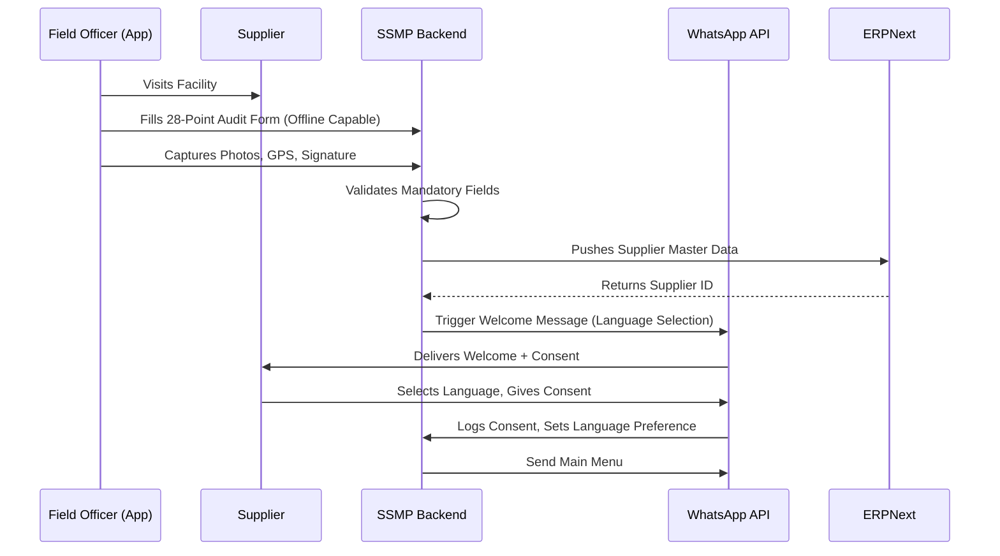

# Srichakra Supplier WhatsApp Experience - Guide

---

## 1. Design Philosophy

- **Zero Friction:** Suppliers use the tool they already have—WhatsApp. No new app installations.
- **Multilingual First:** Every interaction is in the supplier's preferred language (Telugu, Tamil, Hindi, Kannada, English).
- **Magic Links:** When detail views are needed, the system sends authent icated short-links that open in their browser—no login required.
- **Instant Gratification:** Real-time updates on transactions, payments, and logistics.

---

## 2. Supplier Journey: The Six Stages

The supplier's relationship with Srichakra can be visualized in six distinct stages, each with its own WhatsApp interactions.

```
┌─────────────────────────────────────────────────────────────────────────────────┐
│                             SUPPLIER LIFECYCLE                                   │
├───────────┬──────────────┬───────────────┬────────────────┬──────────────┬──────┤
│   STAGE   │   ONBOARD    │   IMPROVE     │   TRANSACT     │   SETTLE     │ GROW │
├───────────┼──────────────┼───────────────┼────────────────┼──────────────┼──────┤
│ TRIGGER   │ Field Visit  │ Audit Gap     │ Material Ready │ QC Complete  │ Time │
├───────────┼──────────────┼───────────────┼────────────────┼──────────────┼──────┤
│ WHATSAPP  │ Welcome Msg  │ Plan Details  │ Booking Menu   │ Debit Note   │ Tier │
│ ACTION    │ Consent      │ Training Link │ Logistics      │ Accept/Disp  │ Upgrade│
└───────────┴──────────────┴───────────────┴────────────────┴──────────────┴──────┘
```

---

## 3. Stage 1: Onboarding

### 3.1 Overview

A supplier is onboarded when a **Field Officer** visits their facility and conducts a 28-point evaluation using the SSMP mobile app. Upon successful registration, the supplier receives their first WhatsApp message from the Srichakra Business Account.

### 3.2 The Welcome Flow (WhatsApp)

**Message 1: Welcome & Language Selection**

```
┌─────────────────────────────────────────────┐
│  🏭 Srichakra POLYPLAST                     │
│                                             │
│  Namaskaram!                                │
│                                             │
│  You have been successfully registered      │
│  as a supplier with Srichakra.             │
│                                             │
│  Please select your preferred language:     │
│                                             │
│  ┌─────────────────────────────────────┐   │
│  │ 1. English                          │   │
│  │ 2. తెలుగు (Telugu)                   │   │
│  │ 3. தமிழ் (Tamil)                     │   │
│  │ 4. हिन्दी (Hindi)                     │   │
│  │ 5. ಕನ್ನಡ (Kannada)                   │   │
│  └─────────────────────────────────────┘   │
└─────────────────────────────────────────────┘
```

**Message 2: Consent Request (After Language Selection)**

```
┌─────────────────────────────────────────────┐
│  🏭 Srichakra POLYPLAST                     │
│                                             │
│  ధన్యవాదములు! మీ భాష: తెలుగు               │
│  (Thank you! Your language: Telugu)         │
│                                             │
│  మేము మీ వివరాలను (పేరు, ఫోన్, చిరునామా,     │
│  బ్యాంక్ వివరాలు) లావాదేవీల కోసం             │
│  నిల్వ చేస్తాము.                            │
│                                             │
│  దయచేసి అంగీకరించండి:                       │
│                                             │
│  [✅ నేను అంగీకరిస్తున్నాను]  [❌ తిరస్కరించు] │
└─────────────────────────────────────────────┘
```

_System Note: If consent is declined, data is not persisted, and the account manager is notified._

**Message 3: Main Menu (After Consent)**

```
┌─────────────────────────────────────────────┐
│  🏭 Srichakra POLYPLAST                     │
│                                             │
│  🎉 స్వాగతం! మీ ఖాతా సిద్ధంగా ఉంది.          │
│                                             │
│  మీకు ఏమి కావాలో ఎంచుకోండి:                │
│                                             │
│  ┌─────────────────────────────────────┐   │
│  │ 💰 చెల్లింపులు/లెడ్జర్ చూడండి          │   │
│  │ 🚚 లాజిస్టిక్స్ బుక్ చేయండి             │   │
│  │ 📦 మెటీరియల్ పంపండి (నోటిఫై)           │   │
│  │ 📉 నాణ్యత నివేదికలు                    │   │
│  │ 🎓 శిక్షణ & రివార్డ్స్                   │   │
│  │ 🔗 నా సబ్-సప్లయర్లు                     │   │
│  │ 📞 సహాయం / మీ అకౌంట్ మేనేజర్          │   │
│  └─────────────────────────────────────┘   │
└─────────────────────────────────────────────┘
```

### 3.3 Onboarding Data Flow



---

## 4. Stage 2: Improvement Plans & Training

### 4.1 Overview

Based on the 28-point evaluation, if a supplier has gaps (e.g., no fire extinguisher, missing PPE, no child labor policy), an **Improvement Plan** is generated. This plan is communicated and tracked via WhatsApp.

### 4.2 Improvement Plan Notification

**Message: Improvement Plan Assigned**

```
┌─────────────────────────────────────────────┐
│  🏭 Srichakra POLYPLAST                     │
│                                             │
│  📋 మీ మెరుగుదల ప్రణాళిక సిద్ధంగా ఉంది      │
│                                             │
│  మీ అంచనా ఆధారంగా, కింది అంశాలపై            │
│  మెరుగుదల అవసరం:                           │
│                                             │
│  ❌ అగ్నిమాపక పరికరం లేదు                    │
│  ❌ కార్మికులకు PPE అందుబాటులో లేదు         │
│                                             │
│  🗓️ గడువు: 15 మార్చి 2026                   │
│                                             │
│  [📄 పూర్తి ప్రణాళిక చూడండి]                 │
│  [✅ నేను అర్థం చేసుకున్నాను]                │
└─────────────────────────────────────────────┘
```

_When "View Full Plan" is clicked, a magic link opens a browser page showing the complete improvement plan with photos and detailed requirements._

### 4.3 Training Invitation

**Message: Training Schedule**

```
┌─────────────────────────────────────────────┐
│  🏭 Srichakra POLYPLAST                     │
│                                             │
│  🎓 శిక్షణ ఆహ్వానం                           │
│                                             │
│  మీరు మరియు మీ కార్మికులు కింది            │
│  శిక్షణకు ఆహ్వానించబడ్డారు:                  │
│                                             │
│  📚 అంశం: భద్రత & PPE వాడకం                 │
│  📍 ప్రదేశం: శ్రీచక్ర ట్రైనింగ్ సెంటర్         │
│  🗓️ తేదీ: 20 ఫిబ్రవరి 2026, 10:00 AM       │
│  👥 హాజరుకాగలిగినవారు: 5 మంది వరకు          │
│                                             │
│  [✅ హాజరవుతాము]  [❌ హాజరుకాలేము]           │
│  [📞 కాల్ బ్యాక్ రిక్వెస్ట్]                  │
└─────────────────────────────────────────────┘
```

### 4.4 Post-Training Feedback

**Message: Training Feedback Request**

```
┌─────────────────────────────────────────────┐
│  🏭 Srichakra POLYPLAST                     │
│                                             │
│  🙏 శిక్షణకు హాజరైనందుకు ధన్యవాదాలు!         │
│                                             │
│  దయచేసి మీ అభిప్రాయం తెలియజేయండి:         │
│                                             │
│  శిక్షణ ఎంత ఉపయోగకరంగా ఉంది?               │
│                                             │
│  [⭐⭐⭐⭐⭐ చాలా మంచిది]                     │
│  [⭐⭐⭐⭐ మంచిది]                            │
│  [⭐⭐⭐ ఓకే]                                 │
│  [⭐⭐ మెరుగుపరచాలి]                         │
│  [⭐ సంతృప్తికరం కాదు]                       │
│                                             │
│  [💬 వ్యాఖ్య జోడించండి]                      │
└─────────────────────────────────────────────┘
```

---

## 5. Stage 3: Transactions - Material Dispatch & Logistics

### 5.1 Overview

Once a supplier is qualified, they can start supplying material. This stage covers:

- Notifying Srichakra that material is ready
- Booking logistics (if needed)
- Tracking the shipment

### 5.2 The Main Transaction Menu

When a supplier types "Hi" or interacts with the bot, they get the main menu. Selecting **"🚚 Book Logistics"** or **"📦 Notify Material Ready"** starts this flow.

**Option A: Notify Material Ready (Own Transport)**

```
┌─────────────────────────────────────────────┐
│  🏭 Srichakra POLYPLAST                     │
│                                             │
│  📦 మెటీరియల్ సిద్ధంగా ఉంది                  │
│                                             │
│  మీ మెటీరియల్ వివరాలు నమోదు చేయండి:         │
│                                             │
│  1️⃣ మెటీరియల్ రకం:                         │
│  ┌─────────────────────────────────────┐   │
│  │ • PET క్లియర్ (బాటిల్స్)               │   │
│  │ • PET గ్రీన్                          │   │
│  │ • PET బ్రౌన్                          │   │
│  │ • HDPE                               │   │
│  │ • PP                                 │   │
│  │ • మిక్స్డ్ ప్లాస్టిక్                   │   │
│  └─────────────────────────────────────┘   │
└─────────────────────────────────────────────┘
```

**After Material Type Selection:**

```
┌─────────────────────────────────────────────┐
│  🏭 Srichakra POLYPLAST                     │
│                                             │
│  📦 PET క్లియర్ ఎంపిక చేయబడింది              │
│                                             │
│  2️⃣ అంచనా పరిమాణం (టన్నులలో):              │
│                                             │
│  ┌─────────────────────────────────────┐   │
│  │ • 1-2 టన్నులు                        │   │
│  │ • 2-5 టన్నులు                        │   │
│  │ • 5-10 టన్నులు                       │   │
│  │ • 10+ టన్నులు                        │   │
│  └─────────────────────────────────────┘   │
│                                             │
│  లేదా నంబర్ టైప్ చేయండి (ఉదా: 3.5)          │
└─────────────────────────────────────────────┘
```

**Transport Selection:**

```
┌─────────────────────────────────────────────┐
│  🏭 Srichakra POLYPLAST                     │
│                                             │
│  🚚 రవాణా ఎలా జరుగుతుంది?                   │
│                                             │
│  ┌─────────────────────────────────────┐   │
│  │ 🚛 నేనే పంపుతాను (నా వాహనం)           │   │
│  │ 🏭 శ్రీచక్ర లాజిస్టిక్స్ బుక్ చేయండి     │   │
│  └─────────────────────────────────────┘   │
└─────────────────────────────────────────────┘
```

### 5.3 Option B: Book Srichakra Logistics

**If "Book Srichakra Logistics" is selected:**

```
┌─────────────────────────────────────────────┐
│  🏭 Srichakra POLYPLAST                     │
│                                             │
│  🚚 లాజిస్టిక్స్ బుకింగ్                       │
│                                             │
│  మీ స్థానం: హైదరాబాద్, కూకట్‌పల్లి           │
│  గమ్యస్థానం: శ్రీచక్ర సెంటర్ - పటాన్‌చెరు     │
│  పరిమాణం: 5 టన్నులు                         │
│                                             │
│  అందుబాటులో ఉన్న వాహనాలు:                   │
│                                             │
│  ┌─────────────────────────────────────┐   │
│  │ 🚛 DCM (5-7 టన్) - ₹2,500            │   │
│  │ 🚚 ట్రక్ (10+ టన్) - ₹4,000           │   │
│  │ 🛺 టెంపో (1-3 టన్) - ₹1,200          │   │
│  └─────────────────────────────────────┘   │
│                                             │
│  💡 ఖర్చు మీ చెల్లింపు నుండి తీసివేయబడుతుంది │
└─────────────────────────────────────────────┘
```

**Vehicle Selection & Pickup Scheduling:**

```
┌─────────────────────────────────────────────┐
│  🏭 Srichakra POLYPLAST                     │
│                                             │
│  ✅ DCM ఎంపిక చేయబడింది - ₹2,500             │
│                                             │
│  📍 పికప్ స్థానం షేర్ చేయండి:                │
│                                             │
│  [📍 ప్రస్తుత లొకేషన్ షేర్ చేయండి]           │
│                                             │
│  లేదా చిరునామా టైప్ చేయండి                   │
└─────────────────────────────────────────────┘
```

**After Location Share:**

```
┌─────────────────────────────────────────────┐
│  🏭 Srichakra POLYPLAST                     │
│                                             │
│  🗓️ పికప్ తేదీ ఎంపిక చేయండి:                │
│                                             │
│  ┌─────────────────────────────────────┐   │
│  │ • ఈ రోజు (3 ఫిబ్రవరి)                │   │
│  │ • రేపు (4 ఫిబ్రవరి)                  │   │
│  │ • ఎల్లుండి (5 ఫిబ్రవరి)              │   │
│  │ • వేరే తేదీ ఎంచుకోండి               │   │
│  └─────────────────────────────────────┘   │
└─────────────────────────────────────────────┘
```

**Booking Confirmation:**

```
┌─────────────────────────────────────────────┐
│  🏭 Srichakra POLYPLAST                     │
│                                             │
│  ✅ బుకింగ్ నిర్ధారించబడింది!                │
│                                             │
│  📋 బుకింగ్ వివరాలు:                        │
│  ──────────────────────                     │
│  🆔 బుకింగ్ ID: SCL-20260203-4521          │
│  📦 మెటీరియల్: PET క్లియర్ (5 టన్నులు)        │
│  🚛 వాహనం: DCM                              │
│  💰 ఖర్చు: ₹2,500 (చెల్లింపు నుండి తీసివేత) │
│  📍 పికప్: కూకట్‌పల్లి, హైదరాబాద్            │
│  🗓️ తేదీ: 4 ఫిబ్రవరి 2026                   │
│  ⏰ సమయం: 9:00 AM - 12:00 PM               │
│                                             │
│  డ్రైవర్ వివరాలు పికప్ రోజు పంపబడతాయి.       │
│                                             │
│  [📄 బుకింగ్ డౌన్‌లోడ్]  [❌ రద్దు చేయండి]   │
└─────────────────────────────────────────────┘
```

### 5.4 Material Dispatch Notification

**When truck leaves supplier location (self-transport):**

```
┌─────────────────────────────────────────────┐
│  🏭 Srichakra POLYPLAST                     │
│                                             │
│  🚛 ట్రక్ బయలుదేరింది                        │
│                                             │
│  మీ షిప్‌మెంట్ నమోదు చేయబడింది:             │
│                                             │
│  🆔 ట్రిప్ ID: SCT-20260203-1128            │
│  📦 మెటీరియల్: PET క్లియర్                   │
│  ⚖️ పంపిన పరిమాణం: 5.2 టన్నులు              │
│  🕐 బయలుదేరిన సమయం: 10:32 AM               │
│  📍 గమ్యస్థానం: శ్రీచక్ర పటాన్‌చెరు సెంటర్    │
│                                             │
│  గేట్ ఎంట్రీ తర్వాత నోటిఫికేషన్ వస్తుంది.    │
│                                             │
│  [📍 ట్రాక్ షిప్‌మెంట్]                       │
└─────────────────────────────────────────────┘
```

---

## 6. Stage 4: Quality Check & Settlement

### 6.1 Overview

This is the most critical stage for supplier trust. When material arrives at the Srichakra center:

1. It is weighed (Gross Weight → Tare Weight → Net Weight)
2. It undergoes Quality Check (QC)
3. Any contamination is documented with photos
4. A Debit Note is generated if there's contamination
5. The supplier must acknowledge/dispute before payment is released

### 6.2 Material Received Notification

```
┌─────────────────────────────────────────────┐
│  🏭 Srichakra POLYPLAST                     │
│                                             │
│  ✅ మెటీరియల్ అందుకున్నాము!                  │
│                                             │
│  🆔 ట్రిప్ ID: SCT-20260203-1128            │
│  📍 సెంటర్: పటాన్‌చెరు                        │
│  🕐 గేట్ ఎంట్రీ: 12:45 PM                    │
│                                             │
│  ⚖️ వెయింగ్ వివరాలు:                        │
│  ──────────────────────                     │
│  గ్రాస్ బరువు: 5,450 kg                      │
│  టేర్ బరువు: 250 kg                         │
│  నెట్ బరువు: 5,200 kg (5.2 టన్నులు)          │
│                                             │
│  ⏳ QC జరుగుతోంది...                        │
│  QC రిపోర్ట్ 2-4 గంటల్లో పంపబడుతుంది.       │
└─────────────────────────────────────────────┘
```

### 6.3 QC Report - No Issues (Best Case)

```
┌─────────────────────────────────────────────┐
│  🏭 Srichakra POLYPLAST                     │
│                                             │
│  ✅ QC పూర్తయింది - మంచి నాణ్యత!             │
│                                             │
│  🆔 ట్రిప్: SCT-20260203-1128               │
│  📦 మెటీరియల్: PET క్లియర్                   │
│  ⚖️ నెట్ బరువు: 5,200 kg                    │
│                                             │
│  📊 నాణ్యత సారాంశం:                         │
│  ──────────────────────                     │
│  ✅ PET క్లియర్: 5,100 kg @ ₹52/kg          │
│  ℹ️ PET గ్రీన్: 100 kg @ ₹48/kg             │
│                                             │
│  💰 మొత్తం విలువ: ₹2,70,000                  │
│  ➖ రవాణా: ₹2,500                           │
│  ═══════════════════                        │
│  💵 చెల్లించవలసినది: ₹2,67,500              │
│                                             │
│  చెల్లింపు 24 గంటల్లో ప్రాసెస్ అవుతుంది.     │
│                                             │
│  [📄 పూర్తి QC రిపోర్ట్]  [✅ అంగీకరించండి]  │
└─────────────────────────────────────────────┘
```

### 6.4 QC Report - With Debit Note (Contamination Found)

```
┌─────────────────────────────────────────────┐
│  🏭 Srichakra POLYPLAST                     │
│                                             │
│  ⚠️ QC పూర్తయింది - కలుషితాలు కనుగొనబడ్డాయి │
│                                             │
│  🆔 ట్రిప్: SCT-20260203-1128               │
│  📦 మెటీరియల్: PET క్లియర్                   │
│  ⚖️ నెట్ బరువు: 5,200 kg                    │
│                                             │
│  📊 నాణ్యత విశ్లేషణ:                        │
│  ──────────────────────                     │
│  ✅ PET క్లియర్: 4,600 kg @ ₹52/kg          │
│  ⚠️ PET గ్రీన్: 200 kg @ ₹48/kg             │
│  ⚠️ డిగ్రేడెడ్: 150 kg @ ₹35/kg             │
│  ❌ మెటల్/మట్టి: 250 kg @ ₹0/kg             │
│                                             │
│  📷 కలుషిత మెటీరియల్ ఫోటోలు:                │
│  [🖼️ ఫోటో 1]  [🖼️ ఫోటో 2]  [🖼️ ఫోటో 3]    │
│                                             │
│  💰 గణన:                                    │
│  ──────────────────────                     │
│  PET క్లియర్: ₹2,39,200                      │
│  PET గ్రీన్: ₹9,600                          │
│  డిగ్రేడెడ్: ₹5,250                          │
│  ──────────────────────                     │
│  సబ్‌టోటల్: ₹2,54,050                        │
│  ➖ రవాణా: ₹2,500                           │
│  ═══════════════════                        │
│  💵 చెల్లించవలసినది: ₹2,51,550              │
│                                             │
│  📋 డెబిట్ నోట్: ₹15,950                     │
│  (అసలు PO విలువ నుండి తగ్గింపు)             │
│                                             │
│  [✅ అంగీకరించండి]  [❌ వివాదం లేవనెత్తండి]  │
└─────────────────────────────────────────────┘
```

### 6.5 Dispute Flow

**If Supplier clicks "Raise Dispute":**

```
┌─────────────────────────────────────────────┐
│  🏭 Srichakra POLYPLAST                     │
│                                             │
│  ❓ వివాదం లేవనెత్తండి                       │
│                                             │
│  దయచేసి మీ ఆందోళన తెలియజేయండి:             │
│                                             │
│  ┌─────────────────────────────────────┐   │
│  │ 1. కలుషిత % అధికంగా ఉంది             │   │
│  │ 2. మెటీరియల్ వర్గీకరణ తప్పు            │   │
│  │ 3. బరువు తేడా                        │   │
│  │ 4. ఇతరం (వివరించండి)                 │   │
│  └─────────────────────────────────────┘   │
└─────────────────────────────────────────────┘
```

**After selecting reason:**

```
┌─────────────────────────────────────────────┐
│  🏭 Srichakra POLYPLAST                     │
│                                             │
│  📝 వివాదం నమోదు చేయబడింది                  │
│                                             │
│  🆔 వివాద ID: DIS-20260203-0023            │
│  📋 కారణం: కలుషిత % అధికంగా ఉంది            │
│                                             │
│  మీ అకౌంట్ మేనేజర్ (రాజేష్) 4 గంటల్లో        │
│  మిమ్మల్ని సంప్రదిస్తారు.                    │
│                                             │
│  ⏸️ చెల్లింపు వివాదం పరిష్కారం వరకు         │
│  పెండింగ్‌లో ఉంటుంది.                        │
│                                             │
│  [📞 ఇప్పుడే కాల్ చేయండి]                    │
└─────────────────────────────────────────────┘
```

### 6.6 Dispute Resolution

**After Account Manager resolves:**

```
┌─────────────────────────────────────────────┐
│  🏭 Srichakra POLYPLAST                     │
│                                             │
│  ✅ వివాదం పరిష్కరించబడింది                  │
│                                             │
│  🆔 వివాద ID: DIS-20260203-0023            │
│                                             │
│  📋 పరిష్కారం:                              │
│  కలుషిత % 4.8% నుండి 3.5%కి సవరించబడింది.  │
│                                             │
│  💰 నవీకరించిన చెల్లింపు:                    │
│  ──────────────────────                     │
│  కొత్త మొత్తం: ₹2,58,200                     │
│  ➖ రవాణా: ₹2,500                           │
│  ═══════════════════                        │
│  💵 చెల్లించవలసినది: ₹2,55,700              │
│                                             │
│  [✅ అంగీకరించండి]                           │
└─────────────────────────────────────────────┘
```

### 6.7 Payment Confirmation

```
┌─────────────────────────────────────────────┐
│  🏭 Srichakra POLYPLAST                     │
│                                             │
│  💰 చెల్లింపు విజయవంతం!                     │
│                                             │
│  🆔 ట్రిప్: SCT-20260203-1128               │
│  💵 మొత్తం: ₹2,55,700                        │
│  🏦 బ్యాంక్: HDFC XXXX1234                   │
│  🕐 సమయం: 3 ఫిబ్రవరి 2026, 4:32 PM         │
│  📋 UTR: HDFC1234567890                     │
│                                             │
│  [📄 రసీదు డౌన్‌లోడ్]                        │
│  [📊 లెడ్జర్ చూడండి]                         │
└─────────────────────────────────────────────┘
```

---

## 7. Stage 5: Ledger & Financial Management

### 7.1 Check Payment Status

**When supplier selects "💰 Check Payments/Ledger":**

```
┌─────────────────────────────────────────────┐
│  🏭 Srichakra POLYPLAST                     │
│                                             │
│  💰 మీ చెల్లింపు స్థితి                      │
│                                             │
│  📅 గత 30 రోజులు:                           │
│  ──────────────────────                     │
│                                             │
│  ✅ INV-0045 | 28 జన | ₹1,85,000 | చెల్లించబడింది │
│  ✅ INV-0044 | 22 జన | ₹2,10,500 | చెల్లించబడింది │
│  ⏳ INV-0046 | 02 ఫిబ్ | ₹2,55,700 | ప్రాసెసింగ్  │
│                                             │
│  💵 మొత్తం చెల్లించబడింది: ₹3,95,500         │
│  ⏳ పెండింగ్: ₹2,55,700                      │
│                                             │
│  [📄 PDF లెడ్జర్ డౌన్‌లోడ్]                   │
│  [📅 కాలం మార్చండి]                          │
│  [🔙 మెయిన్ మెనూ]                            │
└─────────────────────────────────────────────┘
```

### 7.2 Rate Card View

**When supplier wants to see current rates:**

```
┌─────────────────────────────────────────────┐
│  🏭 Srichakra POLYPLAST                     │
│                                             │
│  📋 ప్రస్తుత రేట్ కార్డ్                      │
│  (3 ఫిబ్రవరి 2026 నాటికి చెల్లుబాటు)         │
│                                             │
│  ┌─────────────────────────────────────┐   │
│  │ మెటీరియల్           │ రేటు (₹/kg)   │   │
│  ├─────────────────────────────────────┤   │
│  │ PET క్లియర్          │ ₹52           │   │
│  │ PET గ్రీన్           │ ₹48           │   │
│  │ PET బ్రౌన్           │ ₹45           │   │
│  │ PET డిగ్రేడెడ్        │ ₹35           │   │
│  │ HDPE క్లీన్          │ ₹42           │   │
│  │ HDPE మిక్స్డ్         │ ₹38           │   │
│  │ PP                  │ ₹40           │   │
│  │ మిక్స్డ్ ప్లాస్టిక్    │ ₹25           │   │
│  └─────────────────────────────────────┘   │
│                                             │
│  ⚠️ రేట్లు మార్కెట్ ధరల ఆధారంగా మారవచ్చు.   │
│                                             │
│  [📞 నెగోషియేట్ చేయండి]  [🔙 మెయిన్ మెనూ]    │
└─────────────────────────────────────────────┘
```

---

## 8. Stage 6: Sub-Supplier Management & Traceability

### 8.1 Overview

For EPR compliance and brand traceability requirements, suppliers must register their own sub-suppliers (Tier 2, Tier 3). This creates a verified chain of custody.

### 8.2 Add Sub-Supplier Menu

**When supplier selects "🔗 My Sub-Suppliers":**

```
┌─────────────────────────────────────────────┐
│  🏭 Srichakra POLYPLAST                     │
│                                             │
│  🔗 మీ సబ్-సప్లయర్ల నెట్‌వర్క్               │
│                                             │
│  📊 మీ నెట్‌వర్క్:                           │
│  ──────────────────────                     │
│  ✅ ధృవీకరించబడినవి: 5                       │
│  ⏳ పెండింగ్: 2                              │
│                                             │
│  🏆 ట్రేసబిలిటీ పాయింట్లు: 150              │
│  (ప్రతి ధృవీకరించిన సబ్-సప్లయర్‌కు 25 పాయింట్లు) │
│                                             │
│  [➕ కొత్త సబ్-సప్లయర్ జోడించండి]            │
│  [👥 నా సబ్-సప్లయర్ల జాబితా]                 │
│  [🎁 రివార్డ్స్ చూడండి]                      │
│  [🔙 మెయిన్ మెనూ]                            │
└─────────────────────────────────────────────┘
```

### 8.3 Add New Sub-Supplier

**Generate Invitation Link:**

```
┌─────────────────────────────────────────────┐
│  🏭 Srichakra POLYPLAST                     │
│                                             │
│  ➕ సబ్-సప్లయర్ జోడించండి                    │
│                                             │
│  మీ సబ్-సప్లయర్‌ని ఎలా జోడించాలనుకుంటున్నారు? │
│                                             │
│  ┌─────────────────────────────────────┐   │
│  │ 📲 ఆహ్వాన లింక్ షేర్ చేయండి          │   │
│  │ ✏️ వివరాలు నేనే నమోదు చేస్తాను       │   │
│  └─────────────────────────────────────┘   │
└─────────────────────────────────────────────┘
```

**If "Share Invitation Link":**

```
┌─────────────────────────────────────────────┐
│  🏭 Srichakra POLYPLAST                     │
│                                             │
│  🔗 ఆహ్వాన లింక్ సిద్ధం!                     │
│                                             │
│  ఈ లింక్‌ని మీ సబ్-సప్లయర్‌కు పంపండి:        │
│                                             │
│  https://sc.link/join/SUP1234-ABCD          │
│                                             │
│  ⏰ లింక్ 7 రోజులు చెల్లుబాటు అవుతుంది.       │
│                                             │
│  వారు రిజిస్టర్ అయిన తర్వాత:                │
│  1. మా ఫీల్డ్ టీం ధృవీకరిస్తుంది             │
│  2. మీకు నోటిఫికేషన్ వస్తుంది                │
│  3. 25 పాయింట్లు మీ ఖాతాలో జమ అవుతాయి       │
│                                             │
│  [📤 WhatsApp ద్వారా షేర్ చేయండి]            │
│  [📋 లింక్ కాపీ చేయండి]                      │
└─────────────────────────────────────────────┘
```

### 8.4 Sub-Supplier Registration (From Their Side)

**When sub-supplier clicks the link and registers:**

```
┌─────────────────────────────────────────────┐
│  🏭 Srichakra POLYPLAST                     │
│                                             │
│  🎉 స్వాగతం!                                 │
│                                             │
│  మీరు [రాజు ట్రేడర్స్] ద్వారా                │
│  ఆహ్వానించబడ్డారు.                          │
│                                             │
│  దయచేసి మీ వివరాలు నమోదు చేయండి:           │
│                                             │
│  [మూ పేరు టైప్ చేయండి]                      │
│                                             │
│  (లేదా ఫారం నింపడానికి కాల్ కోసం ఎదురుచూడండి) │
└─────────────────────────────────────────────┘
```

### 8.5 Sub-Supplier Verified Notification (To Parent Supplier)

```
┌─────────────────────────────────────────────┐
│  🏭 Srichakra POLYPLAST                     │
│                                             │
│  ✅ సబ్-సప్లయర్ ధృవీకరించబడింది!             │
│                                             │
│  👤 పేరు: గణేష్ వేస్ట్ కలెక్టర్స్             │
│  📍 స్థానం: సికింద్రాబాద్                     │
│  📞 ఫోన్: XXXXXX7890                        │
│                                             │
│  🎁 +25 పాయింట్లు మీ ఖాతాలో జమ అయ్యాయి!     │
│  🏆 మొత్తం పాయింట్లు: 175                    │
│                                             │
│  [👥 నా సబ్-సప్లయర్ల జాబితా]                 │
│  [🎁 రివార్డ్స్ చూడండి]                      │
└─────────────────────────────────────────────┘
```

---

## 9. Rewards & Loyalty Program

### 9.1 Points Overview

**When supplier selects "🎓 Training & Rewards":**

```
┌─────────────────────────────────────────────┐
│  🏭 Srichakra POLYPLAST                     │
│                                             │
│  🏆 మీ రివార్డ్స్ డాష్‌బోర్డ్                 │
│                                             │
│  ⭐ మీ లెవెల్: 🥈 సిల్వర్ సప్లయర్            │
│  (గోల్డ్ కోసం 500 పాయింట్లు అవసరం)           │
│                                             │
│  🏆 మొత్తం పాయింట్లు: 175                    │
│  💎 రిడీమ్ చేయగలిగేవి: 150                   │
│                                             │
│  📊 పాయింట్లు ఎలా సంపాదించాలి:              │
│  ──────────────────────                     │
│  ✅ ప్రతి షిప్‌మెంట్: 10 పాయింట్లు           │
│  ✅ సబ్-సప్లయర్ జోడించడం: 25 పాయింట్లు       │
│  ✅ శిక్షణ పూర్తి: 15 పాయింట్లు              │
│  ✅ 0% వివాదం నెల: 50 పాయింట్లు             │
│                                             │
│  [🎁 రివార్డ్స్ రిడీమ్ చేయండి]               │
│  [📈 లెవెల్ బెనిఫిట్స్ చూడండి]               │
│  [🔙 మెయిన్ మెనూ]                            │
└─────────────────────────────────────────────┘
```

### 9.2 Redeemable Rewards

```
┌─────────────────────────────────────────────┐
│  🏭 Srichakra POLYPLAST                     │
│                                             │
│  🎁 అందుబాటులో ఉన్న రివార్డ్స్               │
│  (మీ పాయింట్లు: 150)                        │
│                                             │
│  ┌─────────────────────────────────────┐   │
│  │ 🛒 ₹500 అమెజాన్ వౌచర్ - 100 pts    │   │
│  │ 📱 ₹200 మొబైల్ రీచార్జ్ - 50 pts    │   │
│  │ 🧤 PPE కిట్ (గ్లవ్స్+మాస్క్) - 75 pts │   │
│  │ 🎒 శ్రీచక్ర బ్రాండెడ్ బ్యాగ్ - 60 pts  │   │
│  │ 🏆 గోల్డ్ లెవెల్ అప్‌గ్రేడ్ - 500 pts  │   │
│  └─────────────────────────────────────┘   │
│                                             │
│  ఏదైనా ఎంచుకోండి:                           │
└─────────────────────────────────────────────┘
```

---

## 10. Quick Menu Reference Card

This is a complete reference of all WhatsApp menu options available to suppliers at different stages.

### 10.1 Main Menu Options

| Option                 | Icon | Description                                                   | Available To           |
| ---------------------- | ---- | ------------------------------------------------------------- | ---------------------- |
| Check Payments/Ledger  | 💰   | View payment status, transaction history, download PDF ledger | All Verified Suppliers |
| Book Logistics         | 🚚   | Book Srichakra logistics for material pickup                  | All Verified Suppliers |
| Notify Material Ready  | 📦   | Inform about material availability for self-transport         | All Verified Suppliers |
| Quality Reports        | 📉   | View QC reports, contamination details, debit notes           | All Verified Suppliers |
| Training & Rewards     | 🎓   | Access training schedules, reward points, redeem rewards      | All Suppliers          |
| My Sub-Suppliers       | 🔗   | Manage traceability network, add sub-suppliers                | All Verified Suppliers |
| Help / Account Manager | 📞   | Contact account manager, raise support ticket                 | All Suppliers          |
| Rate Card              | 📋   | View current purchase rates for all material types            | All Suppliers          |
| Change Language        | 🌐   | Switch interface language                                     | All Suppliers          |

### 10.2 Contextual Buttons (Appear in Specific Flows)

| Button            | Context                | Action                             |
| ----------------- | ---------------------- | ---------------------------------- |
| ✅ Accept         | QC Report / Debit Note | Acknowledge and proceed to payment |
| ❌ Raise Dispute  | QC Report              | Open dispute ticket                |
| 📍 Share Location | Logistics Booking      | Share GPS for pickup               |
| 📄 Download PDF   | Ledger / QC Report     | Get detailed document              |
| 📞 Call Now       | Support / Dispute      | Initiate call to account manager   |
| 🔙 Main Menu      | All flows              | Return to main menu                |

## 12. Technical Implementation Notes

### 12.1 Data Flow Architecture

```
┌─────────────────────────────────────────────────────────────────────────┐
│                                                                         │
│   SUPPLIER                    SSMP                         ERPNext     │
│   (WhatsApp)                (Backend)                     (ERP)        │
│                                                                         │
│   ┌─────────┐              ┌──────────┐               ┌──────────┐    │
│   │         │──Message──→ │          │──API Call──→ │          │    │
│   │ WhatsApp│              │  SSMP    │               │ ERPNext  │    │
│   │  User   │←──Reply───  │ Backend  │←──Response── │  Server  │    │
│   │         │              │          │               │          │    │
│   └─────────┘              └──────────┘               └──────────┘    │
│       │                         │                          │           │
│       │                         │                          │           │
│       ▼                         ▼                          ▼           │
│  ┌─────────┐              ┌──────────┐               ┌──────────┐    │
│  │  Magic  │              │ Supplier │               │Transaction│   │
│  │  Links  │              │  Data    │               │   Data   │    │
│  │ (Web)   │              │ (SSMP DB)│               │ (ERP DB) │    │
│  └─────────┘              └──────────┘               └──────────┘    │
│                                                                         │
└─────────────────────────────────────────────────────────────────────────┘
```

### 12.3 Language Support Implementation

- **Language Detection:** Based on first-time selection stored in supplier profile
- **Message Templates:** All templates stored with language variants
- **Dynamic Content:** Fetched data (amounts, dates) formatted per locale
- **Fallback:** If translation missing, show English with translation note

---

## 13. Security Considerations

### 13.1 OTP-Protected Actions

The following actions require OTP verification:

| Action                | Risk Level | OTP Required         |
| --------------------- | ---------- | -------------------- |
| First-time Login      | High       | ✅ Yes               |
| Bank Details Change   | Critical   | ✅ Yes               |
| Debit Note Acceptance | High       | ✅ Yes               |
| Dispute Resolution    | Medium     | ❌ No (signed by AM) |
| Logistics Booking     | Low        | ❌ No                |
| View Ledger           | Low        | ❌ No                |

### 13.2 Magic Link Security

- Links are unique per supplier, per session
- Links expire after 30 minutes
- Links are single-use for sensitive documents
- Links contain encrypted supplier ID, not readable info
