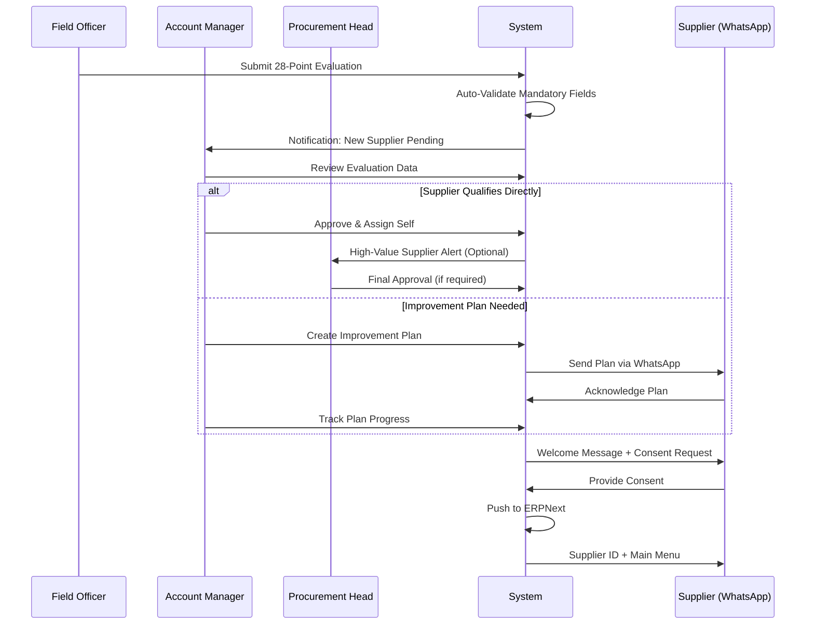
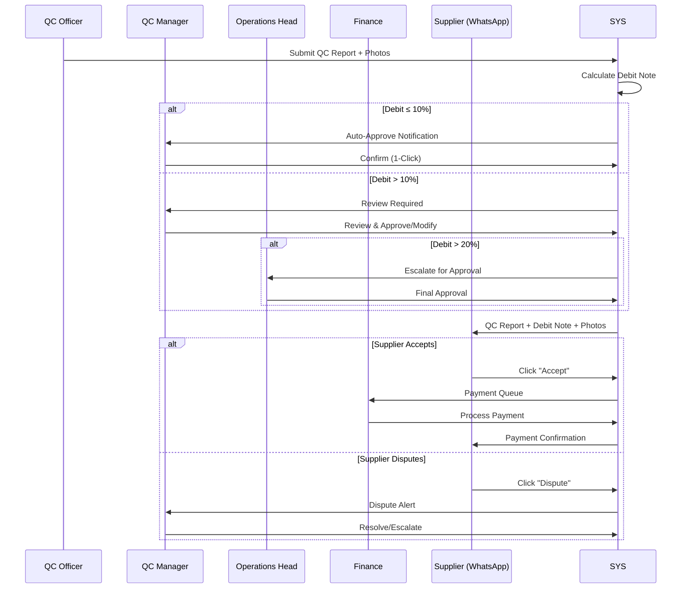
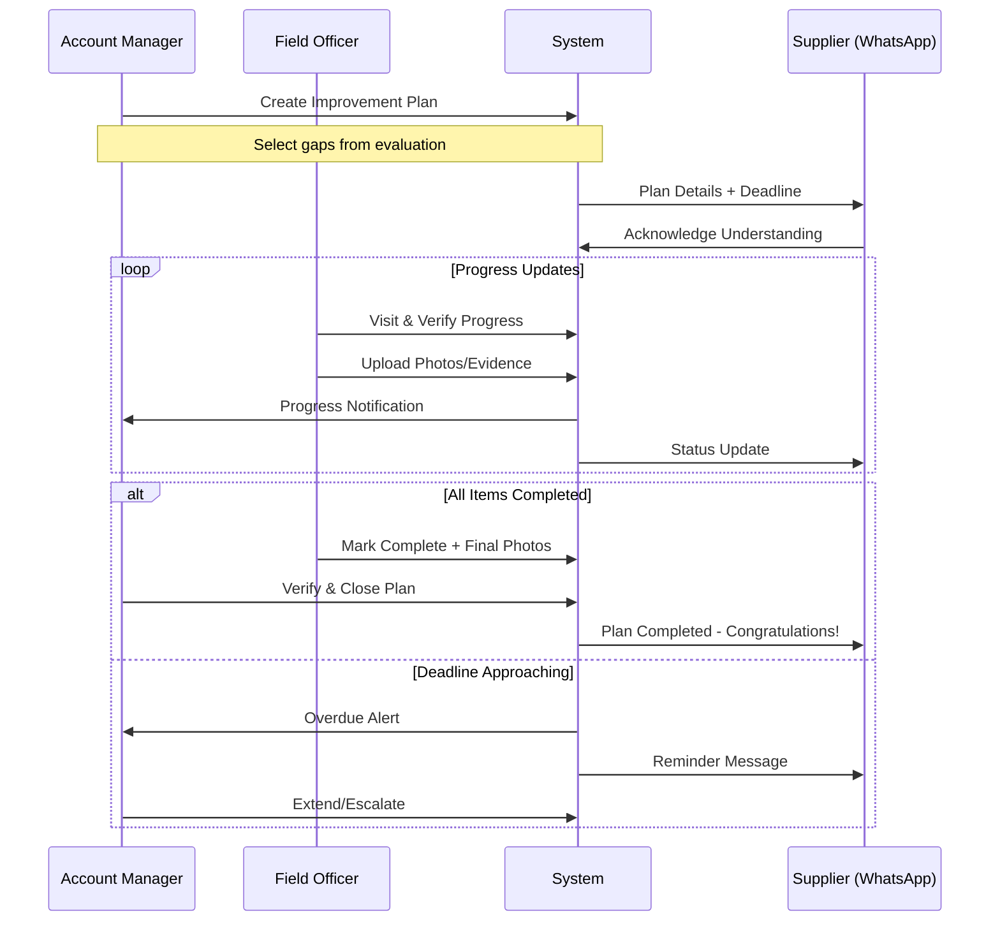

# Srichakra Admin Portal

## 1. Design Philosophy

- **Role-Based Access Control (RBAC):** Each admin sees only what they need
- **Self-Service Configuration:** Business teams can configure without developer help
- **Real-Time Visibility:** Live dashboards with actionable insights
- **Audit Trail:** Every action is logged for compliance

---

## 2. Admin Roles & Hierarchy

```
┌─────────────────────────────────────────────────────────────────────────────────┐
│                              ADMIN ROLE HIERARCHY                                │
├─────────────────────────────────────────────────────────────────────────────────┤
│                                                                                  │
│                           ┌──────────────────┐                                  │
│                           │   SUPER ADMIN    │                                  │
│                           │   (IT/System)    │                                  │
│                           └────────┬─────────┘                                  │
│                                    │                                            │
│          ┌─────────────────────────┼─────────────────────────┐                  │
│          │                         │                         │                  │
│   ┌──────▼──────┐          ┌───────▼───────┐          ┌──────▼──────┐          │
│   │ PROCUREMENT │          │   OPERATIONS  │          │   FINANCE   │          │
│   │    HEAD     │          │     HEAD      │          │    HEAD     │          │
│   └──────┬──────┘          └───────┬───────┘          └──────┬──────┘          │
│          │                         │                         │                  │
│   ┌──────▼──────┐          ┌───────▼───────┐          ┌──────▼──────┐          │
│   │   ACCOUNT   │          │   QC MANAGER  │          │  ACCOUNTS   │          │
│   │   MANAGER   │          │               │          │   PAYABLE   │          │
│   └──────┬──────┘          └───────┬───────┘          └─────────────┘          │
│          │                         │                                            │
│   ┌──────▼──────┐          ┌───────▼───────┐                                   │
│   │    FIELD    │          │  QC OFFICER   │                                   │
│   │   OFFICER   │          │               │                                   │
│   └─────────────┘          └───────────────┘                                   │
│                                                                                  │
└─────────────────────────────────────────────────────────────────────────────────┘
```

---

## 3. Role Definitions & Permissions

### 3.1 Super Admin (IT/System Administrator)

**Primary Responsibility:** System configuration, user management, integrations

| Permission             | Access Level |
| :--------------------- | :----------- |
| User Management        | Full CRUD    |
| Role Configuration     | Full CRUD    |
| System Settings        | Full Access  |
| API Configurations     | Full Access  |
| Audit Logs             | View All     |
| Data Export            | Full Access  |
| Form Builder           | Full Access  |
| Notification Templates | Full CRUD    |

### 3.2 Procurement Head

**Primary Responsibility:** Strategic procurement decisions, supplier approvals

| Permission                 | Access Level    |
| :------------------------- | :-------------- |
| Supplier Approval          | Final Approval  |
| Account Manager Assignment | Full CRUD       |
| Rate Card Management       | Approve/Publish |
| PO Approval (High Value)   | Approve         |
| Supplier Reports           | Full Access     |
| Debit Note Override        | Approve         |

### 3.3 Account Manager

**Primary Responsibility:** Supplier relationship, improvement plans, training

| Permission                | Access Level        |
| :------------------------ | :------------------ |
| Supplier Onboarding       | Initiate/Track      |
| Improvement Plans         | Create/Assign/Track |
| Training Schedules        | Create/Manage       |
| Supplier Communication    | Full Access         |
| Sub-Supplier Verification | Approve/Reject      |
| Field Officer Assignment  | Manage              |

### 3.4 Field Officer

**Primary Responsibility:** On-ground supplier visits, evaluations, audits

| Permission                | Access Level  |
| :------------------------ | :------------ |
| Supplier Evaluation       | Create/Submit |
| Photo/GPS Capture         | Full Access   |
| Sub-Supplier Registration | Create        |
| Training Attendance       | Mark/Record   |
| Improvement Verification  | Update Status |

### 3.5 Operations Head

**Primary Responsibility:** Plant operations, QC oversight, logistics

| Permission           | Access Level   |
| :------------------- | :------------- |
| QC Reports           | View All       |
| Debit Note Approval  | Final Approval |
| Logistics Management | Full Access    |
| Inventory Reports    | Full Access    |
| Gate Entry Override  | Approve        |

### 3.6 QC Manager

**Primary Responsibility:** Quality control, contamination assessment

| Permission            | Access Level    |
| :-------------------- | :-------------- |
| QC Entry              | Full CRUD       |
| Contamination Photos  | Upload          |
| Debit Note Generation | Create/Submit   |
| Material Grading      | Full Access     |
| Dispute Resolution    | Handle/Escalate |

### 3.7 Finance Head / Accounts Payable

**Primary Responsibility:** Payments, ledger, financial compliance

| Permission                | Access Level    |
| :------------------------ | :-------------- |
| Payment Processing        | Approve/Execute |
| Ledger View               | Full Access     |
| Invoice Generation        | Create          |
| Bank Details Verification | Approve         |
| Financial Reports         | Full Access     |

---

## 4. Dashboard Views by Role

### 4.1 Super Admin Dashboard

```
┌─────────────────────────────────────────────────────────────────────────────────┐
│  🔧 SUPER ADMIN DASHBOARD                                     [Settings] [Logout]│
├─────────────────────────────────────────────────────────────────────────────────┤
│                                                                                  │
│  ┌─────────────────┐  ┌─────────────────┐  ┌─────────────────┐  ┌─────────────┐│
│  │ 👥 Active Users │  │ 🔄 API Health   │  │ 📊 System Load  │  │ ⚠️ Alerts   ││
│  │      45/50      │  │    99.8% ✓      │  │     32% CPU     │  │     3       ││
│  └─────────────────┘  └─────────────────┘  └─────────────────┘  └─────────────┘│
│                                                                                  │
│  ┌─────────────────────────────────────────────────────────────────────────────┐│
│  │ 📋 QUICK ACTIONS                                                            ││
│  ├─────────────────────────────────────────────────────────────────────────────┤│
│  │ [+ Add User] [+ Create Role] [📝 Edit Forms] [🔗 Manage APIs] [📤 Export]  ││
│  └─────────────────────────────────────────────────────────────────────────────┘│
│                                                                                  │
│  ┌────────────────────────────────┐  ┌────────────────────────────────────────┐│
│  │ 📝 RECENT AUDIT LOGS           │  │ 🛠️ PENDING CONFIGURATIONS              ││
│  ├────────────────────────────────┤  ├────────────────────────────────────────┤│
│  │ • Rajesh modified Rate Card    │  │ • WhatsApp Template: Tamil (Pending)  ││
│  │   Today, 10:32 AM              │  │ • New Question Added: Fire Safety     ││
│  │ • Priya added Field Officer    │  │ • Logistics API: Delivery Integration ││
│  │   Today, 09:45 AM              │  │                                        ││
│  │ • System Backup Completed      │  │ [View All →]                           ││
│  │   Today, 02:00 AM              │  │                                        ││
│  └────────────────────────────────┘  └────────────────────────────────────────┘│
│                                                                                  │
└─────────────────────────────────────────────────────────────────────────────────┘
```

### 4.2 Procurement Head Dashboard

```
┌─────────────────────────────────────────────────────────────────────────────────┐
│  📦 PROCUREMENT HEAD DASHBOARD                                [Profile] [Logout]│
├─────────────────────────────────────────────────────────────────────────────────┤
│                                                                                  │
│  ┌─────────────────┐  ┌─────────────────┐  ┌─────────────────┐  ┌─────────────┐│
│  │ 🏭 Active       │  │ ⏳ Pending      │  │ 📊 This Month   │  │ 🚨 Disputes ││
│  │   Suppliers     │  │   Approvals     │  │   Procurement   │  │   Open      ││
│  │      156        │  │      12         │  │   ₹2.4 Cr       │  │     5       ││
│  └─────────────────┘  └─────────────────┘  └─────────────────┘  └─────────────┘│
│                                                                                  │
│  ┌─────────────────────────────────────────────────────────────────────────────┐│
│  │ ⏳ PENDING APPROVALS                                          [View All →]  ││
│  ├──────┬─────────────────────────┬────────────┬───────────┬──────────────────┤│
│  │ Type │ Description             │ Requested  │ Amount    │ Action           ││
│  ├──────┼─────────────────────────┼────────────┼───────────┼──────────────────┤│
│  │ 🆕   │ New Supplier: Raju      │ 2 hrs ago  │ -         │ [Approve][Reject]││
│  │      │ Traders, Hyderabad      │            │           │                  ││
│  │ 📋   │ Rate Card Update: PET   │ 1 day ago  │ ₹52→₹54   │ [Approve][Reject]││
│  │ 🚨   │ Debit Override: DN-4521 │ 3 hrs ago  │ ₹15,950   │ [Review][Approve]││
│  │ 📦   │ High Value PO: PO-8891  │ 5 hrs ago  │ ₹8.5L     │ [Approve][Reject]││
│  └──────┴─────────────────────────┴────────────┴───────────┴──────────────────┘│
│                                                                                  │
│  ┌────────────────────────────────┐  ┌────────────────────────────────────────┐│
│  │ 📈 SUPPLIER PERFORMANCE        │  │ 🗓️ UPCOMING AUDITS                     ││
│  │ [Bar Chart: Top 10 Suppliers]  │  │ • 5 Feb - Ganesh Traders (Annual)     ││
│  │                                │  │ • 8 Feb - Krishna Waste (Quarterly)   ││
│  │ View: [Weekly▼] [By Volume▼]   │  │ • 12 Feb - 3 Suppliers (Hyderabad)    ││
│  └────────────────────────────────┘  └────────────────────────────────────────┘│
└─────────────────────────────────────────────────────────────────────────────────┘
```

### 4.3 Account Manager Dashboard

```
┌─────────────────────────────────────────────────────────────────────────────────┐
│  👤 ACCOUNT MANAGER DASHBOARD - Rajesh Kumar                  [Profile] [Logout]│
├─────────────────────────────────────────────────────────────────────────────────┤
│                                                                                  │
│  ┌─────────────────┐  ┌─────────────────┐  ┌─────────────────┐  ┌─────────────┐│
│  │ 🏭 My Suppliers │  │ 📋 Active Plans │  │ 🎓 Trainings    │  │ ⚠️ Attention ││
│  │      28         │  │      15         │  │   This Week: 3  │  │     7       ││
│  └─────────────────┘  └─────────────────┘  └─────────────────┘  └─────────────┘│
│                                                                                  │
│  ┌─────────────────────────────────────────────────────────────────────────────┐│
│  │ ⚠️ REQUIRES ATTENTION                                                       ││
│  ├─────────────────────────────────────────────────────────────────────────────┤│
│  │ 🔴 Ramu Plastics - Improvement Plan overdue by 5 days     [Contact][Extend] ││
│  │ 🟡 Krishna Traders - Sub-supplier verification pending    [Verify][Assign]  ││
│  │ 🟡 New dispute raised by Ganesh Waste Collectors          [View][Resolve]   ││
│  │ 🟢 Training feedback pending from 3 suppliers             [Send Reminder]   ││
│  └─────────────────────────────────────────────────────────────────────────────┘│
│                                                                                  │
│  ┌────────────────────────────────┐  ┌────────────────────────────────────────┐│
│  │ 📋 MY IMPROVEMENT PLANS        │  │ 🗓️ TODAY'S SCHEDULE                    ││
│  ├────────────────────────────────┤  ├────────────────────────────────────────┤│
│  │ In Progress: 8                 │  │ 10:00 AM - Training: Safety & PPE      ││
│  │ Pending Start: 4               │  │            Location: Training Center   ││
│  │ Overdue: 3 ⚠️                  │  │ 02:00 PM - Call with Supplier A        ││
│  │ Completed This Month: 12       │  │ 04:00 PM - Field Visit: New Supplier   ││
│  │ [View All Plans →]             │  │                                        ││
│  └────────────────────────────────┘  └────────────────────────────────────────┘│
└─────────────────────────────────────────────────────────────────────────────────┘
```

### 4.4 QC Manager Dashboard

```
┌─────────────────────────────────────────────────────────────────────────────────┐
│  🔬 QC MANAGER DASHBOARD - Patancheru Center                  [Profile] [Logout]│
├─────────────────────────────────────────────────────────────────────────────────┤
│                                                                                  │
│  ┌─────────────────┐  ┌─────────────────┐  ┌─────────────────┐  ┌─────────────┐│
│  │ 🚛 Trucks Today │  │ ⏳ QC Pending   │  │ 📊 Avg Contam.  │  │ 🚨 Disputes ││
│  │      12         │  │      4          │  │     8.2%        │  │     2       ││
│  └─────────────────┘  └─────────────────┘  └─────────────────┘  └─────────────┘│
│                                                                                  │
│  ┌─────────────────────────────────────────────────────────────────────────────┐│
│  │ 📦 INCOMING MATERIAL - PENDING QC                                           ││
│  ├──────────┬─────────────────┬──────────┬────────────┬───────────────────────┤│
│  │ Trip ID  │ Supplier        │ Material │ Net Wt     │ Action                ││
│  ├──────────┼─────────────────┼──────────┼────────────┼───────────────────────┤│
│  │ SCT-1128 │ Raju Traders    │ PET Clear│ 5,200 kg   │ [Start QC]            ││
│  │ SCT-1129 │ Krishna Waste   │ HDPE     │ 3,100 kg   │ [Start QC]            ││
│  │ SCT-1130 │ Ganesh Coll.    │ Mixed    │ 2,800 kg   │ [Start QC]            ││
│  │ SCT-1127 │ Lakshmi Plastics│ PET Green│ 4,500 kg   │ [QC In Progress: 65%] ││
│  └──────────┴─────────────────┴──────────┴────────────┴───────────────────────┘│
│                                                                                  │
│  ┌────────────────────────────────┐  ┌────────────────────────────────────────┐│
│  │ 🚨 OPEN DISPUTES               │  │ 📊 TODAY'S QC SUMMARY                  ││
│  ├────────────────────────────────┤  ├────────────────────────────────────────┤│
│  │ DIS-0023: Ramu Plastics        │  │ Completed: 8                           ││
│  │ Reason: Contamination % High   │  │ Total Volume: 42.5 Tons                ││
│  │ Raised: 2 hrs ago              │  │ Avg Quality Score: 91.8%               ││
│  │ [View Details] [Resolve]       │  │ Debit Notes Generated: 6               ││
│  └────────────────────────────────┘  └────────────────────────────────────────┘│
└─────────────────────────────────────────────────────────────────────────────────┘
```

### 4.5 Finance Dashboard

```
┌─────────────────────────────────────────────────────────────────────────────────┐
│  💰 FINANCE DASHBOARD                                         [Profile] [Logout]│
├─────────────────────────────────────────────────────────────────────────────────┤
│                                                                                  │
│  ┌─────────────────┐  ┌─────────────────┐  ┌─────────────────┐  ┌─────────────┐│
│  │ 💵 Today's      │  │ ⏳ Pending      │  │ 📊 This Month   │  │ 🏦 Bank     ││
│  │   Payments      │  │   Approvals     │  │   Disbursed     │  │   Balance   ││
│  │   ₹18.5L        │  │      8          │  │   ₹1.2 Cr       │  │   ₹45L      ││
│  └─────────────────┘  └─────────────────┘  └─────────────────┘  └─────────────┘│
│                                                                                  │
│  ┌─────────────────────────────────────────────────────────────────────────────┐│
│  │ ⏳ PAYMENTS AWAITING APPROVAL                                               ││
│  ├──────────┬─────────────────┬────────────┬────────────┬─────────────────────┤│
│  │ Invoice  │ Supplier        │ Amount     │ Status     │ Action              ││
│  ├──────────┼─────────────────┼────────────┼────────────┼─────────────────────┤│
│  │ INV-4521 │ Raju Traders    │ ₹2,55,700  │ QC Approved│ [Approve] [Hold]    ││
│  │ INV-4522 │ Krishna Waste   │ ₹1,85,000  │ QC Approved│ [Approve] [Hold]    ││
│  │ INV-4520 │ Ganesh Coll.    │ ₹3,10,500  │ Disputed   │ [View Dispute]      ││
│  └──────────┴─────────────────┴────────────┴────────────┴─────────────────────┘│
│                                                                                  │
│  ┌────────────────────────────────┐  ┌────────────────────────────────────────┐│
│  │ 📊 PAYMENT TREND               │  │ 🔔 ALERTS                              ││
│  │ [Line Chart: Last 30 Days]     │  │ ⚠️ 3 payments pending > 24 hrs        ││
│  │                                │  │ ⚠️ Bank details change: 2 suppliers   ││
│  │                                │  │ ✅ All reconciliations complete        ││
│  └────────────────────────────────┘  └────────────────────────────────────────┘│
└─────────────────────────────────────────────────────────────────────────────────┘
```

---

## 5. Core Use Cases & Workflows

### 5.1 Supplier Onboarding Approval Flow



### 5.2 QC & Debit Note Approval Flow



### 5.3 Improvement Plan Management Flow



---

## 6. Configuration Modules (Self-Service)

### 6.1 Form Builder

**Purpose:** Admins can create/modify evaluation questionnaires, audit checklists, and training feedback forms without developer involvement.

```
┌─────────────────────────────────────────────────────────────────────────────────┐
│  📝 FORM BUILDER - Supplier Evaluation Form                   [Preview] [Publish]│
├─────────────────────────────────────────────────────────────────────────────────┤
│                                                                                  │
│  ┌─────────────────────────────────────────────────────────────────────────────┐│
│  │ DRAG FIELD TYPES                │  FORM PREVIEW                              ││
│  ├─────────────────────────────────┼────────────────────────────────────────────┤│
│  │ [📝 Text Input    ]             │  ┌────────────────────────────────────┐    ││
│  │ [☑️ Yes/No        ]             │  │ 1. Do you have fire extinguisher?  │    ││
│  │ [🔢 Number        ]             │  │    ○ Yes  ○ No                     │    ││
│  │ [📷 Photo Upload  ]             │  │    📷 If Yes, upload photo         │    ││
│  │ [📍 GPS Location  ]             │  ├────────────────────────────────────┤    ││
│  │ [⭐ Rating 1-5    ]             │  │ 2. Number of workers?              │    ││
│  │ [📅 Date          ]             │  │    [___________] (Number)          │    ││
│  │ [📑 Dropdown      ]             │  ├────────────────────────────────────┤    ││
│  │ [✍️ Signature     ]             │  │ 3. PPE available for workers?      │    ││
│  │                                 │  │    ○ Yes  ○ Partial  ○ No          │    ││
│  └─────────────────────────────────┴────────────────────────────────────────────┘│
│                                                                                  │
│  ┌─────────────────────────────────────────────────────────────────────────────┐│
│  │ FIELD SETTINGS (Selected: Q1)                                               ││
│  ├─────────────────────────────────────────────────────────────────────────────┤│
│  │ Label: [Do you have fire extinguisher?                    ]                 ││
│  │ Required: [✓]    Triggers Improvement Plan if "No": [✓]                     ││
│  │ Conditional Photo: If "Yes" → Force camera (no gallery): [✓]               ││
│  │ Languages: [English ✓] [Telugu ✓] [Tamil ✓] [Hindi ✓]                       ││
│  └─────────────────────────────────────────────────────────────────────────────┘│
└─────────────────────────────────────────────────────────────────────────────────┘
```

### 6.2 Rate Card Management

```
┌─────────────────────────────────────────────────────────────────────────────────┐
│  💰 RATE CARD MANAGEMENT                                      [History] [Publish]│
├─────────────────────────────────────────────────────────────────────────────────┤
│                                                                                  │
│  Current Version: v12 (Published: 28 Jan 2026)         [+ Create New Version]   │
│                                                                                  │
│  ┌─────────────────────────────────────────────────────────────────────────────┐│
│  │ Material Type     │ Grade    │ Current Rate │ New Rate    │ Change          ││
│  ├───────────────────┼──────────┼──────────────┼─────────────┼─────────────────┤│
│  │ PET Clear         │ A        │ ₹52/kg       │ [₹54/kg   ] │ +₹2 (+3.8%)     ││
│  │ PET Clear         │ B        │ ₹48/kg       │ [₹50/kg   ] │ +₹2 (+4.2%)     ││
│  │ PET Green         │ -        │ ₹45/kg       │ [₹45/kg   ] │ No Change       ││
│  │ PET Brown         │ -        │ ₹42/kg       │ [₹42/kg   ] │ No Change       ││
│  │ HDPE Clean        │ -        │ ₹38/kg       │ [₹40/kg   ] │ +₹2 (+5.3%)     ││
│  │ PP                │ -        │ ₹35/kg       │ [₹35/kg   ] │ No Change       ││
│  │ Mixed Plastic     │ -        │ ₹22/kg       │ [₹22/kg   ] │ No Change       ││
│  │ Degraded          │ -        │ ₹15/kg       │ [₹15/kg   ] │ No Change       ││
│  └───────────────────┴──────────┴──────────────┴─────────────┴─────────────────┘│
│                                                                                  │
│  Effective From: [05 Feb 2026  📅]    Notify Suppliers: [✓]                     │
│                                                                                  │
│  [Save Draft]                                          [Submit for Approval →]  │
└─────────────────────────────────────────────────────────────────────────────────┘
```

### 6.3 Notification Template Manager

```
┌─────────────────────────────────────────────────────────────────────────────────┐
│  📱 NOTIFICATION TEMPLATES - WhatsApp                         [+ New Template]  │
├─────────────────────────────────────────────────────────────────────────────────┤
│                                                                                  │
│  ┌──────────────────────────┬──────────┬───────────────┬───────────────────────┐│
│  │ Template Name            │ Type     │ Languages     │ Status                ││
│  ├──────────────────────────┼──────────┼───────────────┼───────────────────────┤│
│  │ Welcome Message          │ Onboard  │ EN,TE,TA,HI   │ ✅ Active             ││
│  │ QC Report Notification   │ QC       │ EN,TE,TA,HI   │ ✅ Active             ││
│  │ Debit Note Alert         │ QC       │ EN,TE,TA,HI   │ ✅ Active             ││
│  │ Payment Confirmation     │ Finance  │ EN,TE,TA,HI   │ ✅ Active             ││
│  │ Training Invitation      │ SSMP     │ EN,TE,TA      │ ⚠️ Tamil Pending     ││
│  │ Improvement Plan         │ SSMP     │ EN,TE         │ ⚠️ Incomplete        ││
│  └──────────────────────────┴──────────┴───────────────┴───────────────────────┘│
│                                                                                  │
│  ┌─────────────────────────────────────────────────────────────────────────────┐│
│  │ EDITING: Debit Note Alert                                                   ││
│  ├─────────────────────────────────────────────────────────────────────────────┤│
│  │ Language: [English ▼]                                                       ││
│  │                                                                              ││
│  │ ┌─────────────────────────────────────────────────────────────────────────┐ ││
│  │ │ ⚠️ QC Completed - Contamination Found                                   │ ││
│  │ │                                                                          │ ││
│  │ │ Trip: {{trip_id}}                                                        │ ││
│  │ │ Net Weight: {{net_weight}} kg                                            │ ││
│  │ │                                                                          │ ││
│  │ │ Debit Note: ₹{{debit_amount}}                                            │ ││
│  │ │ Net Payable: ₹{{net_payable}}                                            │ ││
│  │ │                                                                          │ ││
│  │ │ [✅ Accept] [❌ Dispute]                                                  │ ││
│  │ └─────────────────────────────────────────────────────────────────────────┘ ││
│  │                                                                              ││
│  │ Variables: {{trip_id}}, {{supplier_name}}, {{net_weight}}, {{debit_amount}} ││
│  └─────────────────────────────────────────────────────────────────────────────┘│
└─────────────────────────────────────────────────────────────────────────────────┘
```

---

## 7. Key Management Features

### 7.1 Supplier Master Management

- **Search & Filter:** By name, location, tier, status, account manager
- **Bulk Actions:** Assign account manager, schedule audits, send notifications
- **Supplier Profile:** Complete 360° view with transaction history, QC reports, improvement plans
- **Sub-Supplier Network:** Visual network graph showing tier relationships

### 7.2 Audit Calendar Management

- **Calendar View:** Monthly/weekly view of all scheduled audits
- **Bulk Scheduling:** Schedule audits for multiple suppliers by region/tier
- **Auto-Reminders:** System sends reminders to field officers and suppliers
- **Audit History:** Complete audit trail with scores and improvement tracking

### 7.3 Training Program Management

- **Training Calendar:** Schedule and manage training sessions
- **Attendance Tracking:** Mark attendance via mobile app or WhatsApp
- **Feedback Collection:** Automated feedback forms post-training
- **Impact Reports:** Track improvement metrics post-training

### 7.4 Dispute Resolution Center

- **Dispute Queue:** All open disputes with SLA timers
- **Evidence Review:** Side-by-side view of QC photos and supplier claims
- **Resolution Workflow:** Approve, modify, or escalate disputes
- **Historical Analysis:** Pattern detection for repeat disputes

### 7.5 Reports & Analytics

| Report Type          | Description                                  | Access Level     |
| :------------------- | :------------------------------------------- | :--------------- |
| Supplier Performance | Quality scores, volume trends, dispute rates | All Managers     |
| Procurement Summary  | Daily/weekly/monthly procurement volumes     | Procurement Head |
| QC Analytics         | Contamination trends, debit note patterns    | QC Manager       |
| Financial Reports    | Payments, outstanding, aging analysis        | Finance Head     |
| Traceability Reports | Sub-supplier network, source tracking        | Procurement Head |
| Audit Compliance     | Audit completion rates, improvement tracking | Account Manager  |
| User Activity        | Login history, action logs                   | Super Admin      |

---

## 8. Mobile App for Field Officers

### 8.1 Key Features

```
┌─────────────────────────────────────────────────────────────────────────────────┐
│  📱 FIELD OFFICER MOBILE APP                                                    │
├─────────────────────────────────────────────────────────────────────────────────┤
│                                                                                  │
│  ┌─────────────────┐  ┌─────────────────┐  ┌─────────────────┐                  │
│  │ 🆕 New Supplier │  │ 📋 My Tasks     │  │ 🗺️ Nearby       │                  │
│  │   Evaluation    │  │   Today: 5      │  │   Suppliers     │                  │
│  └─────────────────┘  └─────────────────┘  └─────────────────┘                  │
│                                                                                  │
│  ┌─────────────────┐  ┌─────────────────┐  ┌─────────────────┐                  │
│  │ ✅ Verify       │  │ 🎓 Mark         │  │ 📸 Upload       │                  │
│  │   Improvement   │  │   Attendance    │  │   Evidence      │                  │
│  └─────────────────┘  └─────────────────┘  └─────────────────┘                  │
│                                                                                  │
│  ┌─────────────────────────────────────────────────────────────────────────────┐│
│  │ TODAY'S TASKS                                                               ││
│  ├─────────────────────────────────────────────────────────────────────────────┤│
│  │ ⏰ 10:00 AM - Supplier Evaluation: New Trader, Kukatpally                   ││
│  │ ⏰ 12:30 PM - Verify Improvement: Raju Plastics (Fire Extinguisher)         ││
│  │ ⏰ 03:00 PM - Sub-Supplier Verification: 3 pending                          ││
│  │ ⏰ 05:00 PM - Training Attendance: Safety Workshop                          ││
│  └─────────────────────────────────────────────────────────────────────────────┘│
│                                                                                  │
│  ┌─────────────────────────────────────────────────────────────────────────────┐│
│  │ OFFLINE MODE: ✅ 12 forms cached    │    Last Sync: 5 mins ago              ││
│  └─────────────────────────────────────────────────────────────────────────────┘│
└─────────────────────────────────────────────────────────────────────────────────┘
```

### 8.2 Offline Capabilities

- **Form Caching:** Evaluation forms work without internet
- **Photo Storage:** Images stored locally, synced when online
- **GPS Capture:** Location stamps even in low-connectivity areas
- **Background Sync:** Automatic sync when connection restored
- **Conflict Resolution:** Smart merge for simultaneous edits

---

## 9. Integration Points

### 9.1 ERPNext Integration

| Data Flow        | Direction  | Trigger        |
| :--------------- | :--------- | :------------- |
| Supplier Master  | SSMP → ERP | On Approval    |
| Purchase Order   | ERP → SSMP | On PO Creation |
| QC Report        | SSMP → ERP | On QC Approval |
| Debit Note       | SSMP → ERP | On Acceptance  |
| Payment Status   | ERP → SSMP | On Payment     |
| Ledger Data      | ERP → SSMP | On Demand      |
| Inventory Levels | ERP → SSMP | Real-time      |

### 9.2 WhatsApp Business API

- **Template Messages:** Pre-approved templates for notifications
- **Interactive Buttons:** Accept/Reject, View Details, Call Back
- **Media Messages:** Photos, PDFs (QC reports, ledger statements)
- **Language Detection:** Auto-select based on supplier preference

### 9.3 Logistics Partner APIs

- **Vehicle Availability:** Real-time vehicle options
- **Pricing:** Dynamic pricing based on distance and load
- **Booking Confirmation:** Instant booking with tracking ID
- **Tracking:** Live tracking shared with supplier

### 9.4 Payment Gateway

- **Payment Processing:** Bank transfers to supplier accounts
- **UTR Generation:** Automatic UTR capture and notification
- **Reconciliation:** Daily reconciliation with ERP

---

## 10. Security & Compliance

### 10.1 Data Privacy

- **Consent Management:** Explicit consent before data collection
- **Data Encryption:** All PII encrypted at rest and in transit
- **Access Logs:** Complete audit trail of data access
- **Right to Deletion:** Supplier can request data deletion

### 10.2 Access Control

- **Session Management:** Auto-logout after inactivity
- **IP Whitelisting:** Optional for sensitive roles
- **Two-Factor Authentication:** Mandatory for Super Admin, Finance
- **Role-Based Permissions:** Granular access control

### 10.3 Audit Trail

Every action is logged with:

- User ID
- Timestamp
- Action Type
- Before/After Values
- IP Address
- Device Information

---

## 11. Supplier-Initiated Actions Summary

| Action              | Trigger       | Admin Notification | Approval Required    |
| :------------------ | :------------ | :----------------- | :------------------- |
| Book Logistics      | WhatsApp Menu | Operations         | No (Auto)            |
| View Ledger         | WhatsApp Menu | None               | No                   |
| Raise Dispute       | QC Report     | QC Manager         | Yes                  |
| Accept Debit Note   | QC Report     | Finance            | No (Auto-process)    |
| Add Sub-Supplier    | WhatsApp Menu | Account Manager    | Yes                  |
| Request Call Back   | Any Menu      | Account Manager    | No                   |
| Download Documents  | WhatsApp Link | None               | No                   |
| Update Bank Details | Account Menu  | Finance            | Yes (OTP + Approval) |
