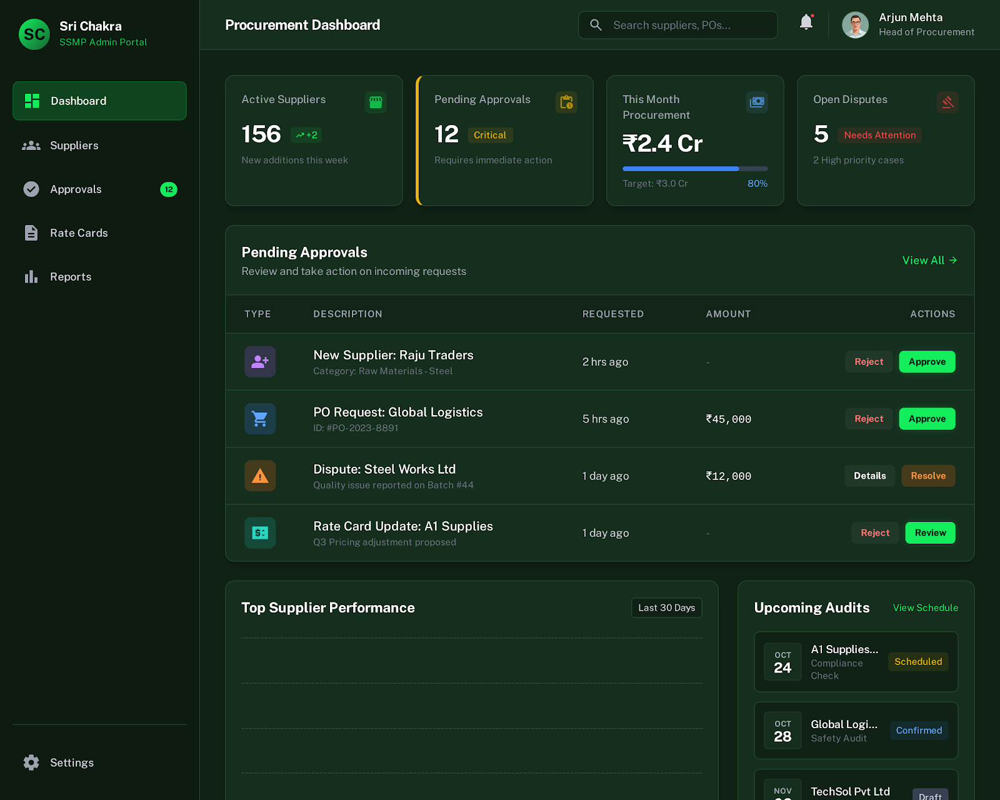
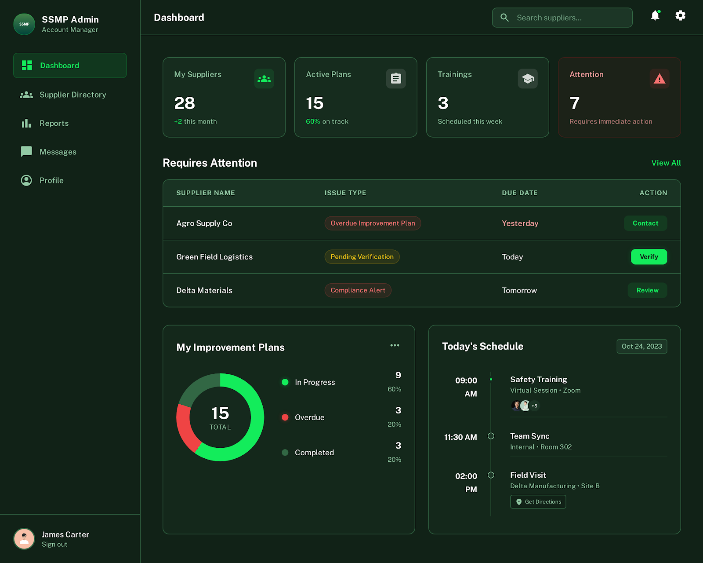
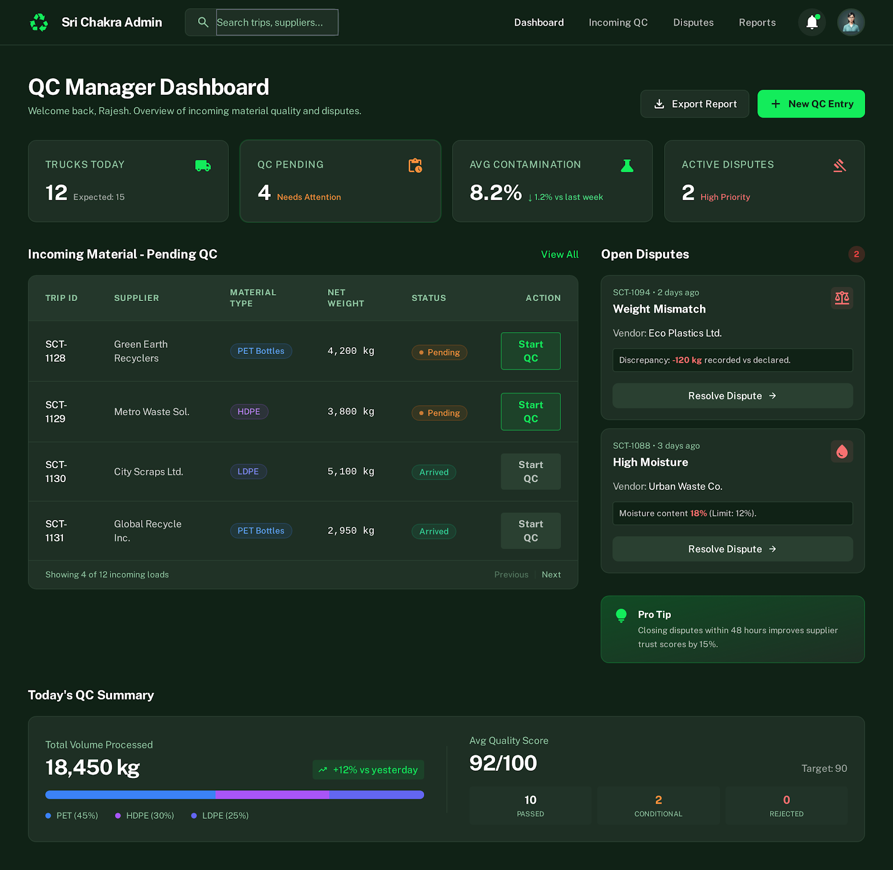
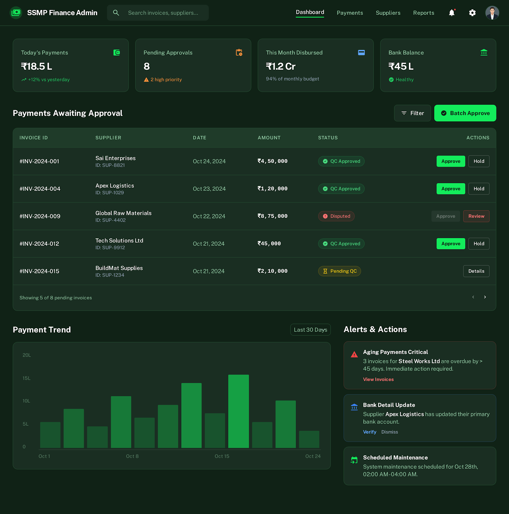

# Admin Portal Visual Walkthrough

## 1. Procurement Head Dashboard

**Role:** Procurement Head
**Focus:** Strategic procurement decisions and supplier approvals.

**Key Features:**

- **Procurement KPIs:** Metrics for Active Suppliers, Pending Approvals, and Monthly Procurement Volume.
- **Approval Queue:** Critical list of items awaiting approval, including New Suppliers, Rate Card Updates, and High Value POs.
- **Performance Tracking:** Top supplier performance charts and upcoming audit schedules.

---

## 2. Account Manager Dashboard

**Role:** Account Manager
**Focus:** Supplier relationship management, improvement plans, and training.

**Key Features:**

- **Portfolio Overview:** "My Suppliers" count, Active Improvement Plans, and Training Sessions.
- **Action Items:** "Requires Attention" section for high-priority tasks like overdue plans or pending verifications.
- **Schedule & Plans:** Daily schedule and status of assigned improvement plans.

---

## 3. QC Manager Dashboard

**Role:** QC Manager
**Focus:** Quality control, contamination assessment, and dispute resolution.

**Key Features:**

- **QC Operations:** Metrics for Trucks Today, Pending QC, and Average Contamination.
- **Incoming Material Queue:** List of incoming trips requiring QC, with status indicators.
- **Dispute Management:** Open disputes requiring resolution and daily QC summaries.

---

## 4. Finance Dashboard

**Role:** Finance Head / Accounts Payable
**Focus:** Payments, ledger management, and financial compliance.

**Key Features:**

- **Financial Overview:** Today's Payments, Pending Approvals, and Bank Disbursals.
- **Payment Queue:** List of invoices awaiting approval with status (e.g., QC Approved).
- **Trends & Alerts:** Payment trend analysis and alerts for pending payments or bank detail changes.
