# Srichakra Supplier WhatsApp Experience - Visual Guide

1. Onboarding & Registration

### Language Selection

The first interaction a supplier has is selecting their preferred language. This ensures all subsequent communication is clearly understood.

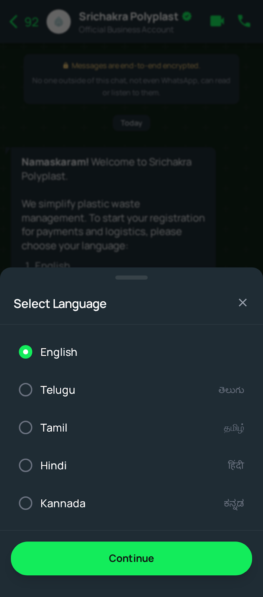

## 2. Main Dashboard

### Main Menu (Telugu)

After onboarding, the supplier sees the main menu options tailored to their language preference (shown here in Telugu). This is the central hub for all actions.

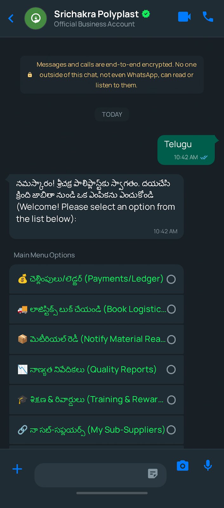

## 3. Material Dispatch Transaction

### Material & Quantity Selection

Suppliers initiate a transaction by specifying the type of material (e.g., PET Clear) and the estimated quantity (in tons).

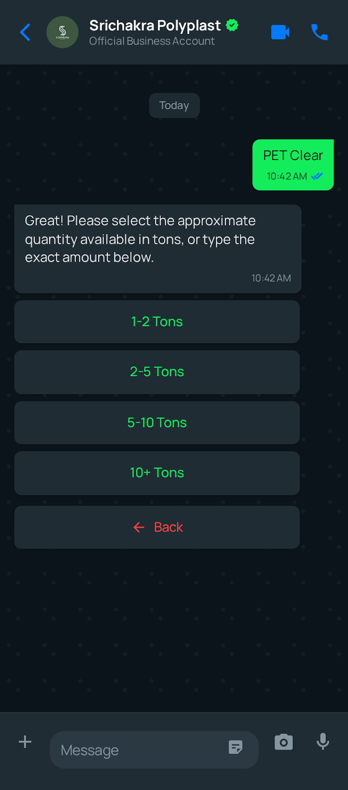

### Vehicle Selection

Suppliers can choose to book Srichakra logistics or use their own transport. If booking logistics, they select the appropriate vehicle type based on the load.

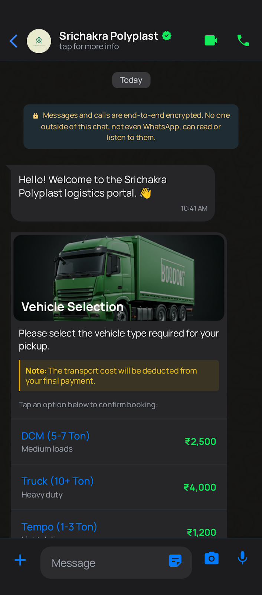

### Booking Confirmation

Once the details are entered, a confirmation message summarizes the booking ID, material, vehicle, and pickup details.

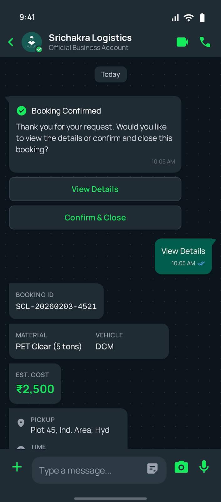

## 4. Quality Check & Financials

### QC Report & Debit Note

After material delivery, the supplier receives a QC report. If contamination is found, a detailed breakdown and resulting debit note are presented immediately.

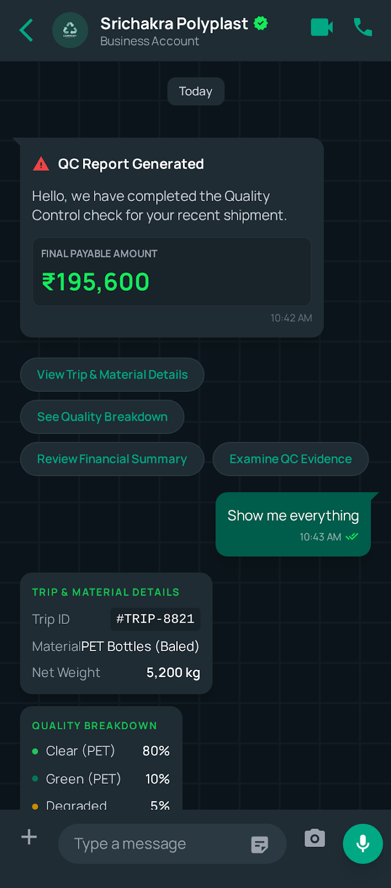

### Raise Dispute

If a supplier disagrees with the QC report or debit note, they can easily raise a dispute directly from the WhatsApp interface by selecting a reason.

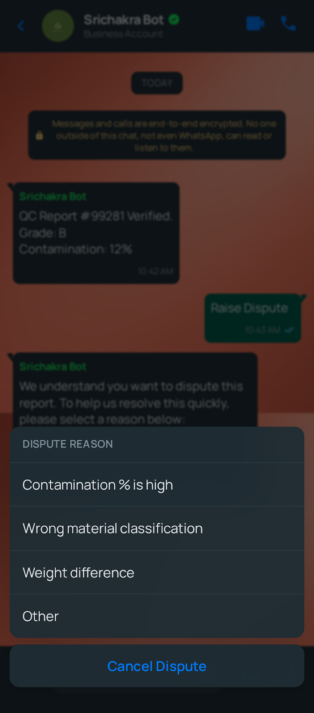

### Payment Ledger

Suppliers can view their financial status, including paid invoices and pending payments, providing transparency and trust.

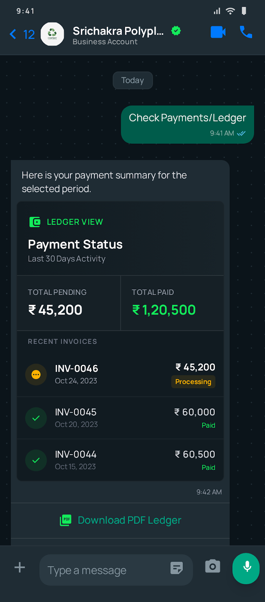

## 5. Ecosystem & Rewards

### Sub-Supplier Network Overview

Suppliers can manage their own network of sub-suppliers (Tier 2), adding traceability to the supply chain.

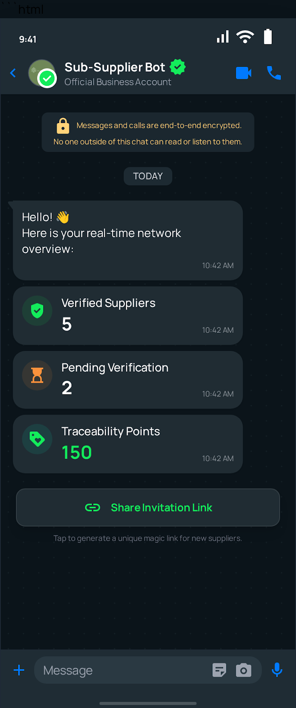

### Adding Sub-Suppliers

Interfaces for adding or inviting new sub-suppliers to the network.

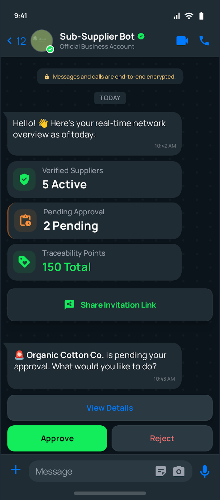

### Rewards Dashboard

A gamified dashboard showing loyalty points earned through shipments, sub-supplier verification, and training, encouraging better performance.

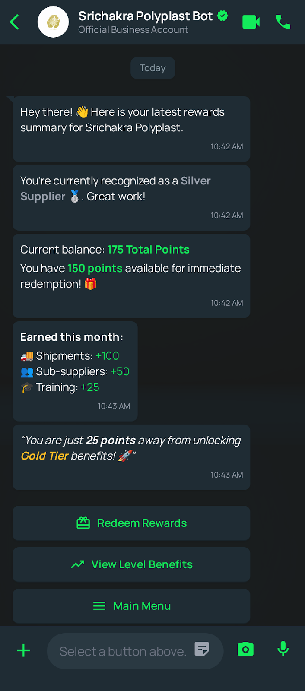
