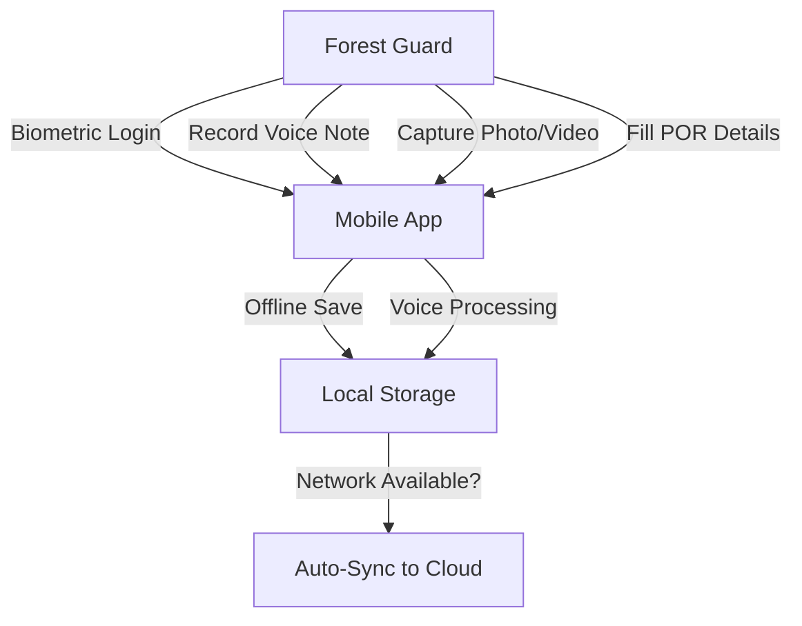
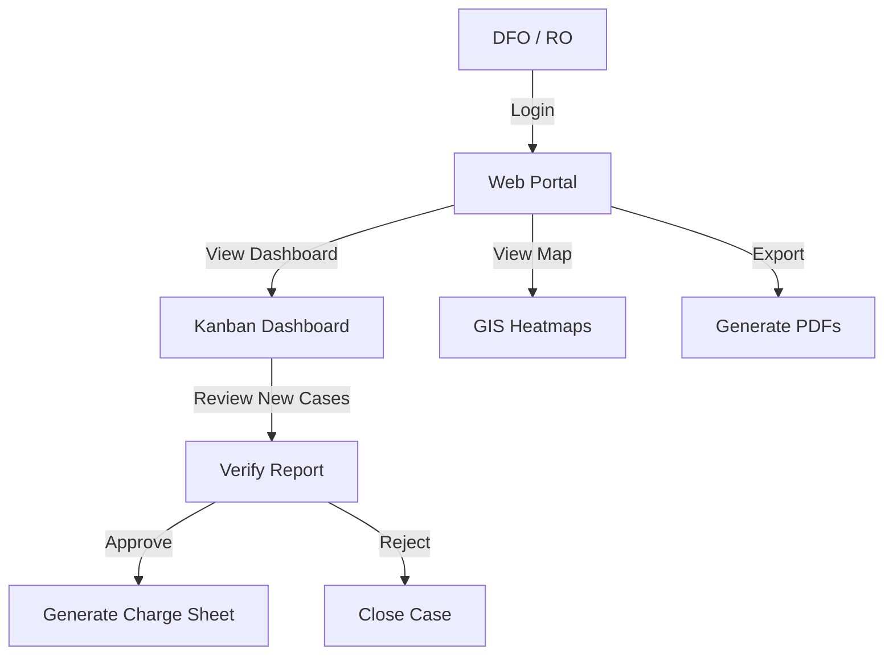

# T-FOMS (Telangana Forest Offense Management System) - Project Implementation Plan

## 1. Problem Understanding

The Telangana Forest Department currently relies on manual, paper-based workflows for reporting forest offenses (smuggling, poaching, encroachment, etc.). This leads to:

- **Delays:** Information takes time to reach decision-makers (DFOs/Rangers).
- **Data Integrity Issues:** Reports can be manipulated or lost; lack of verifiable evidence (location/time).
- **Connectivity Challenges:** Beat officers operate in deep forest areas with no internet, making real-time digital reporting difficult.
- **Lack of Intelligence:** Data is siloed in paper files, preventing spatial analysis (heatmaps) or trend monitoring.

**The Goal:** To build a "Central Nervous System" for forest protection (similar to CCTNS) that digitizes the "First Response" workflow, ensuring speed, transparency, and accountability.

---

## 2. Entity Definitions

### A. Actors (Users)

1.  **Beat Officer / Forest Guard (Field User):**
    - The "eyes and ears" on the ground.
    - Primary Action: Capturing offenses, evidence, and location.
    - Constraint: Often works offline.
2.  **Range Officer (RO) / DFO (Admin/Manager):**
    - The decision-makers at "The HQ".
    - Primary Action: Verifying reports, issuing charge sheets, monitoring dashboards.
3.  **System Admin:**
    - Manages user roles, master data, and configurations.

### B. Key Entities (Data Objects)

1.  **Preliminary Offense Report (POR):**
    - The core record. Contains: Description, Offender Details (if any), Sections of Law.
2.  **Evidence:**
    - **Media:** Photos, Videos (Strictly Camera Capture Only - No Gallery Upload).
    - **Audio:** Voice notes (for AI transcription).
    - **Metadata:** Timestamp, Geo-coordinates (Lat/Long).
3.  **Seizure List:**
    - Inventory of items seized (wood, vehicles, tools).
4.  **Offense Location:**
    - Geospatial point data for mapping and heatmap generation.

---

## 3. Use Case Diagrams

### A. Mobile Application ("The Digital Lathi") - Field Staff

### B. Admin Portal ("The HQ") - Officers

---

## 4. Proposed Solution Structure

Our solution, **T-FOMS**, is an enterprise-grade, offline-first system designed for reliability in remote conditions.

### A. Components

1.  **Mobile App (Flutter):**
    - **Offline First:** Uses local database (SQLite/Hive) to store data in deep forests.
    - **AI Integration:** Python-based NLP service converts voice dictation into structured text (POR fields) automatically.
    - **Security:** Biometric authentication and tamper-proof evidence collection (forced camera usage).
2.  **Web Portal (ReactJS):**
    - **Command Center:** Real-time visibility of all beats.
    - **Kanban Workflow:** Visual case management (Reported -> Verified -> Charge Sheet -> Closed).
    - **One-Click Compliance:** Auto-generates Govt. formatted PDFs (Forms A/B, Seizure Lists).
3.  **Backend & Infrastructure:**
    - **Core API:** Java Spring Boot for robust, secure transaction handling.
    - **Database:** PostgreSQL with PostGIS for advanced geospatial queries.
    - **AI Service:** Python Microservice for speech-to-text.
    - **Deployment:** Dockerized containers orchestrated via Kubernetes.

---

## 5. Solution Walkthrough (Scenario: Teak Wood Smuggling)

**Step 1: Detection & Login**

- **Scene:** A Beat Officer discovers illegal timber cutting in the Sathupally reserve forest.
- **Action:** Opens T-FOMS App. Uses Fingerprint/Face ID to login quickly.

**Step 2: Evidence Capture (The "Digital Lathi")**

- **Action:** Officer taps "New Offense".
- **Media:** Takes photos of the cut wood and the location. _Crucially, the app forces live camera usage and stamps the image with GPS + Time._
- **Voice Note:** Instead of typing long reports on a small screen, the officer speaks: _"Found 10 logs of Teak wood at compartment 45, seized one axe."_

**Step 3: Auto-Processing (Offline)**

- **System:** The app saves the media and audio locally.
- **AI Helper:** If offline, the voice note is stored. (Or processed locally if light models are used, otherwise queued for server processing).

**Step 4: Store & Forward**

- **Scene:** Officer returns to the Range Office (connectivity zone).
- **Action:** App detects network and automatically syncs the POR to the central server. The Python AI service transcribes the audio and pre-fills the text report.

**Step 5: Command Center Review**

- **Scene:** DFO is at the office.
- **Action:** Sees a new notification on the Web Dashboard.
- **Verification:** Reviews the photos, map location, and transcribed text.
- **Result:** Marks the case as "Verified".

**Step 6: Legal Action**

- **Action:** DFO clicks "Generate POR".
- **Output:** The system generates the official PDF document required for the court/department records, complete with the seizure list formatted correctly.

**Step 7: Strategic Analysis**

- **Action:** At month-end, the DFO checks the "GIS Heatmap".
- **Insight:** Notices a cluster of red dots in "Sector B", indicating a hotspot for teak smuggling. Deploys extra patrols to that specific area.

---

## 6. Technical Stack & Key Features

### 1. GIS & Location Intelligence (Heatmap GPS)

- **Technology:** PostgreSQL with **PostGIS** extension.
- **Usage:**
  - Captures high-precision Lat/Long coordinates for every offense.
  - Generates hotspot heatmaps to identify high-risk zones (e.g., smuggling routes).
  - Enables spatial querying (e.g., "Show all offenses within 5km of Sathupally Range").

### 2. Offline Connectivity & Sync (Store-and-Forward)

- **Technology:** Local Database (**SQLite/Hive**) + Background Sync Workers.
- **Usage:**
  - Allows beat officers to work in deep forest "shadow zones" with zero connectivity.
  - Data is encrypted and stored locally on the device.
  - Automatically detects network availability and pushes data to the central server without user intervention.

### 3. Biometric Security

- **Technology:** Native OS Biometrics (Android Biometric API / iOS FaceID).
- **Usage:**
  - Ensures only authorized personnel can access the app.
  - Prevents unauthorized reporting or tampering with evidence.
  - Logs the specific officer's ID with every report for accountability.

### 4. AI-Powered Voice Understanding

- **Technology:** Python Microservice using NLP models (e.g., **OpenAI Whisper** or **Google Speech-to-Text**).
- **Usage:**
  - **Voice-to-Text:** Converts spoken field notes into text summaries.
  - **Entity Extraction:** Automatically identifies intent (e.g., "Teak Wood", "Smuggling", "Quantity: 10") to pre-fill the POR form.
  - Reduces manual typing effort for field staff.

### 5. Core Stack Overview

- **Mobile App:** **Flutter** (Cross-platform for Android/iOS).
- **Web Portal:** **ReactJS** (Responsive modern UI).
- **Backend:** **Java Spring Boot** (Enterprise-grade security and scalability).
- **Infrastructure:** **Docker & Kubernetes** (Containerized deployment).
