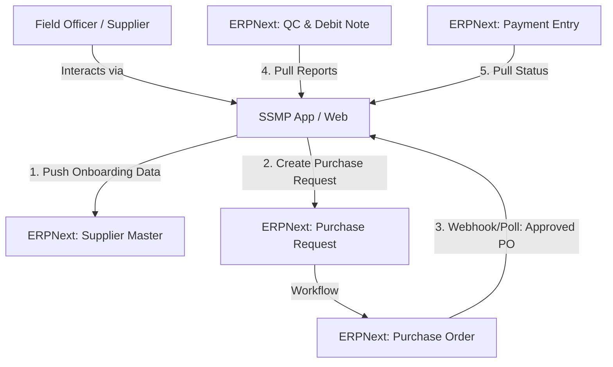

# ERPNext Integration & Architecture for SSMP

## 1. Role of ERPNext in SSMP Ecosystem

Based on the Business Requirement Specification (BRS) and discussions, **ERPNext** serves as the **"Single Source of Truth"** for all financial, inventory, and compliance data. The **SSMP (Sri Chakra Supplier Management Program)** acts as an **Engagement & Experience Layer** on top of ERPNext.

### Key Responsibilities of ERPNext:

- **Central Repository:** Stores master data (Suppliers, Items, Prices) and transactional data (POs, Invoices, Ledgers).
- **Approval Engine:** Manages complex approval workflows for Purchase Orders (PO) based on value/hierarchy.
- **Financial Record:** Generates Debit Notes, processes Payments, and maintains the General Ledger.
- **Inventory Management:** Tracks Inward Gate Entries, Quality Control (QC) reports, and Stock levels.

### Key Responsibilities of SSMP (The App):

- **Supplier Interface:** A lightweight, multilingual frontend for suppliers to view data living in ERPNext without direct ERP access.
- **Field Operations:** Facilitates on-ground tasks (Onboarding, GPS-tagged Shipments) that ERPNext cannot handle natively or easily.
- **Notification Engine:** Bridges the gap between ERP data events and WhatsApp (Vawa) communication.

---

## 2. Architecture & Linkage

The connection between SSMP and ERPNext is **API-First** and **Bidirectional**. SSMP does not duplicate transactional logic; it triggers it in ERPNext or mirrors it for display.

### Data Flow Diagram (Conceptual)

### Critical Touchpoints:

1.  **Onboarding (Push):**
    - Field Officer collects KYC/Consent in SSMP -> Validates via APIs -> **Creates 'Supplier'** record in ERPNext.
2.  **Procurement (Bidirectional):**
    - SSMP: Finalizes Price/Qty with Supplier -> **Creates 'Purchase Request'** in ERPNext.
    - ERPNext: Approves PR -> Generates PO -> **SSMP fetches Approved PO** number and PDF.
3.  **Fulfillment (Pull):**
    - ERPNext records Gate Entry & Quality Inspection -> **SSMP fetches QC Report** & Debit Note details to display to Supplier.
4.  **Finance (Pull):**
    - ERPNext records Payment -> **SSMP fetches Payment Status** for Supplier transparency.

---

## 3. Required Integrations & APIs (Actionable for IT Team)

To achieve the "MVP Live by Week 4" and full features by Week 6, the Sri Chakra IT Team must provide the following **API Access** and **Credentials**.

### A. General Access Requirements

- **Environment:** QA / Staging Environment (preferred over direct Production initially).
- **URL:** The endpoint URL for the ERPNext instance (e.g., `https://erp.srichakra.com`).
- **Authentication:**
  - **System User:** A dedicated user account (e.g., `ssmp_integration@srichakra.com`) is recommended.
  - **API Key & API Secret:** Generated for the above user.

### B. Specific DocType Permissions (Read/Write)

The API User must have permissions for the following standard ERPNext DocTypes:

| #      | Feature             | ERPNext DocType      | Operation      | Purpose                                                             |
| :----- | :------------------ | :------------------- | :------------- | :------------------------------------------------------------------ |
| **1**  | **Master Data**     | `Item`               | **Read**       | To display Material Categories and Codes in Rate Cards.             |
| **2**  | **Master Data**     | `Supplier`           | **Read/Write** | To create new suppliers post-onboarding and fetch existing details. |
| **3**  | **Master Data**     | `Supplier Group`     | **Read**       | To categorize suppliers (e.g., Tier 1, Tier 2) if applicable.       |
| **4**  | **Procurement**     | `Purchase Request`   | **Write**      | To trigger the procurement process from the App.                    |
| **5**  | **Procurement**     | `Purchase Order`     | **Read**       | To fetch approved PO details, Status, and PDF links.                |
| **6**  | **Inventory/QC**    | `Quality Inspection` | **Read**       | To display QC parameters (Moisture, Contamination) to suppliers.    |
| **7**  | **Inventory**       | `Purchase Receipt`   | **Read**       | To track Goods Received Note (GRN) status.                          |
| **8**  | **Finance**         | `Payment Entry`      | **Read**       | To show payment history and status.                                 |
| **9**  | **Finance**         | `Purchase Invoice`   | **Read**       | To view booked invoices and Debit Notes.                            |
| **10** | **Address/Contact** | `Address`, `Contact` | **Read/Write** | To sync Supplier locations and phone numbers.                       |

### C. Custom Fields / Scripts (If Standard is Insufficient)

- **Supplier Master:** May need custom fields for `Aadhaar_Consent_Hash` or `Onboarding_Status` if not standard.
- **Webhooks (Recommended):**
  - Ideally, configure a **Webhook** in ERPNext on `Purchase Order` "Submit" event to notify SSMP immediately.
  - _Alternative:_ SSMP will poll the API periodically (less efficient).

### D. Third-Party Integrations (Managed by/via IT Team)

- **GST Verification:** If the IT team uses an existing GSP (GST Suvidha Provider), we need those credentials or an internal wrapper API.
- **WhatsApp API:** Meta Business Manager admin access to configure the Business Account.
- **CSB Bank:** Access to the banking API portal for Week 6 integration.
