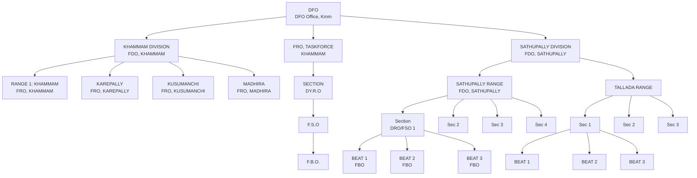

# Hierarchy of Forest Dept. at District

**Administrator:** DFO (DFO Office, Kmm)

The hierarchy splits into three main branches:

## 1. KHAMMAM DIVISION (FDO, KHAMMAM)

- **RANGE 1: KHAMMAM** (FRO, KHAMMAM)
- **KAREPALLY** (FRO, KAREPALLY)
- **KUSUMANCHI** (FRO, KUSUMANCHI)
- **MADHIRA** (FRO, MADHIRA)

## 2. FRO, TASKFORCE, KHAMMAM

- **SECTION** (DY.R.O)
  - F.S.O
  - F.B.O.

## 3. SATHUPALLY DIVISION (FDO, SATHUPALLY)

### A. SATHUPALLY RANGE

- **Section** (DRO/FSO 1)
  - BEAT 1 (FBO)
  - BEAT 2 (FBO)
  - BEAT 3 (FBO)
- **Sec 2**
- **Sec 3**
- **Sec 4**

### B. TALLADA RANGE

- **Sec 1**
  - BEAT 1
  - BEAT 2
  - BEAT 3
- **Sec 2**
- **Sec 3**

## Visual Representation

