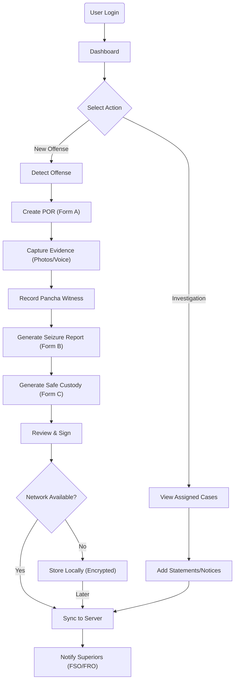

# T-FOMS "Digital Lathi" Mobile Application Design

Based on the [Project Plan](PROJECT_PLAN.md) and [Visual Diagrams](visual_diagrams.md), this document details the design, flows, and interface specifications for the T-FOMS Mobile Application ("Digital Lathi").

## 1. Product Flow (High Level)

The primary goal of the mobile app is to empower field staff (FBOs, FSOs) to instantly digitize the "First Response" to a forest offense, ensuring data integrity and rapid legal processing.

## 2. Roles & Functions (Mobile Specific)

The mobile application is primarily designed for Field Level and Section Level officers.

| Role                                                 | Primary Functions in Mobile App                                                                                                                                                                                                                                                                                                                                                            |
| :--------------------------------------------------- | :----------------------------------------------------------------------------------------------------------------------------------------------------------------------------------------------------------------------------------------------------------------------------------------------------------------------------------------------------------------------------------------- |
| **FBO (Forest Beat Officer) / Taskforce Constable**  | • **Create POR**: Initiate Form A for new offenses. • **Capture Evidence**: Take geotagged photos, record voice notes. • **Seizure**: Generate Form B for seized items (timber, vehicles). • **Safe Custody**: Generate Form C for handing over seized goods. • **Witness Recording**: Log Pancha witness details. • **Offline Mode**: Full functionality without internet. |
| **FSO (Forest Section Officer) / Dy.RO (Taskforce)** | • **All FBO Functions**: Can perform all above actions. • **Verify POR**: Review and verify PORs submitted by FBOs. • **Investigation**: Record 161 Statements, issue 41A CrPC (35 BNSS) notices. • **Status Update**: Update investigation status of ongoing cases.                                                                                                              |

## 3. UI/UX Screen Visualizations & Views

### A. Login & Authentication

- **Visual**: Clean, simple login screen with Forest Department logo.
- **Input**: User ID, Password.
- **Security**: Biometric prompt (Fingerprint/FaceID) after initial login.
- **Action**: "Login", "Forgot Password".

### B. Home Dashboard

- **Visual**: Card-based layout showing quick stats and primary actions.
- **Header**: Officer Name, Current Beat/Section, Sync Status (Green/Red indicator).
- **Quick Actions (FAB or Top Cards)**:
  - 🚨 **Report Offense** (Primary Call-to-Action - Large Red Button)
  - 📂 **My Cases** (List of drafted/submitted PORs)
  - 📍 **Patrol Map** (Current location context)
- **Recent Activity**: List of last 3-5 PORs with status (Draft, Pending Sync, Submitted).

### C. Offense Reporting Flow (The "Digital Lathi" Wizard)

This is a multi-step wizard to ensure complete data capture.

#### Screen 1: Basic Details (Form A - POR)

- **Visual**: Form input fields.
- **Fields**:
  - **Date/Time**: Auto-filled (Editable).
  - **Location**: GPS Coords (Auto-filled), Landmark (Manual/Voice).
  - **Offense Category**: Dropdown (Timber, Wildlife, Encroachment, Fire).
  - **Description**: Large text area with **Microphone Icon** for Voice-to-Text.
- **Actions**: "Next", "Save Draft".

#### Screen 2: Evidence Capture

- **Visual**: Grid of empty photo placeholders.
- **Actions**:
  - **Take Photo**: Opens native camera (Gallery upload DISABLED for integrity).
  - **Photo Tags**: Prompt to tag photo (e.g., "Stump", "Vehicle", "Accused").
- **UX**: Images show timestamp and geo-coords overlay immediately.

#### Screen 3: Seizure Details (Form B)

- **Visual**: List of seized items.
- **Actions**: "Add Item".
- **Add Item Modal**:
  - Type (Log, Vehicle, Tool).
  - Quantity/Dimensions.
  - Marks/Hammer Marks.
- **Output**: Auto-calculates estimated value (if configured) or allows manual entry.

#### Screen 4: Accused & Witness (Pancha)

- **Role**: FBO/FSO.
- **Fields**:
  - **Accused**: Name, Father's Name, Address, Photo.
  - **Witness (Pancha)**: Name, Description of person.
- **Actions**: "Add Accused", "Add Witness".

#### Screen 5: Safe Custody (Form C)

- **Visual**: Selection of custodian.
- **Fields**:
  - **Handed Over To**: Name of Watcher/Guard.
  - **Digital Signature**: Touchpad area for custodian to sign on screen.

#### Screen 6: Review & Submit

- **Visual**: Summary of all entered data.
- **Actions**:
  - **Submit**: Triggers sync. Returns "POR Generated: 2024/KMM/001".
  - **Edit**: Go back to specific sections.

### D. Case List / Investigation View

- **Target**: FSO/Dy.RO.
- **Visual**: List of PORs. Filters: "Pending Investigation", "Submitted".
- **Offense Detail View**:
  - Shows all gathered Forms (A, B, C).
  - **Action Tabs**:
    - **Statements**: "Record 161 Statement" (Voice/Text).
    - **Notices**: "Generate 41A Notice" (Generates PDF to share/print).
    - **History**: Timeline of the case.

## 4. Detailed UI Flows

### Flow 1: Offline POR Creation (Deep Forest Mode)

1.  **Start**: User taps "Report Offense" (No Signal icon visible).
2.  **App Behavior**:
    - GPS locks using device hardware.
    - Voice-to-Text records audio file locally for later processing.
    - Photos saved to encrypted local app storage.
3.  **Completion**: User taps "Submit".
4.  **Feedback**: "Saved to Outbox. Will sync when online."
5.  **Sync**: When device detects network -> Background service uploads data -> Server returns POR Number -> App notifies user.

### Flow 2: Voice-to-Text Investigation

1.  **Context**: FSO interviewing a witness.
2.  **Action**: Opens Case -> Tabs to "Statements" -> Taps "Record New Statement".
3.  **Input**: Taps Microphone. Speaks in Telugu/English mix.
4.  **Process**: App records audio.
5.  **Result**:
    - Audio file attached to case.
    - If Online: Text appears in real-time (or near real-time).
    - User edits the transcribed text for accuracy.
    - User saves as "Section 161 Statement".

## 5. View Actions Summary

| View            | User Actions                            | System Actions                      |
| :-------------- | :-------------------------------------- | :---------------------------------- |
| **Login**       | Enter Creds, Biometric Auth             | Validate, Load Config/Master Data   |
| **Dashboard**   | Start POR, View Map, Check Sync         | Fetch summary stats, Check location |
| **POR Wizard**  | Enter Data, Record Voice, Take Pix      | Auto-save draft, Geo-tag, Encrypt   |
| **Case List**   | Filter, Search, Select Case             | Fetch list from Local DB/Server     |
| **Case Detail** | View Forms, Add Statement, Issue Notice | Render PDF previews, Play audio     |
| **Settings**    | Change Language, Manual Sync            | Clear local cache (if safe)         |
