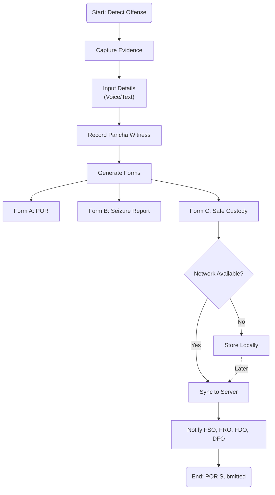
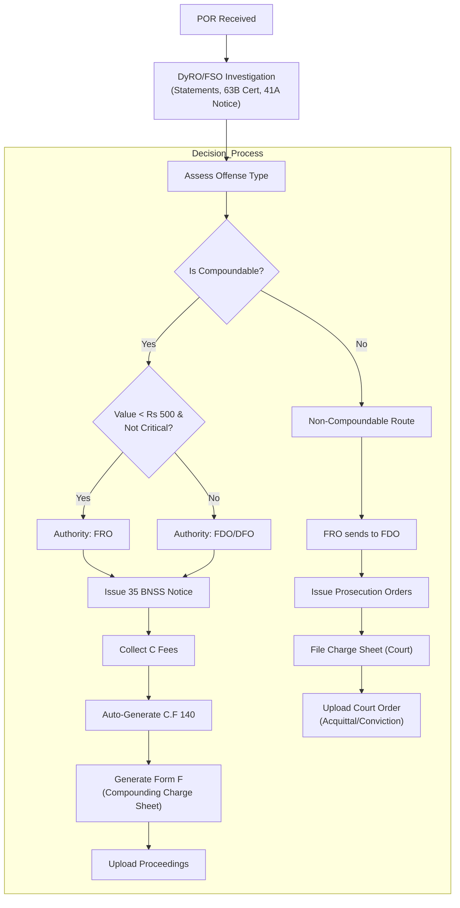
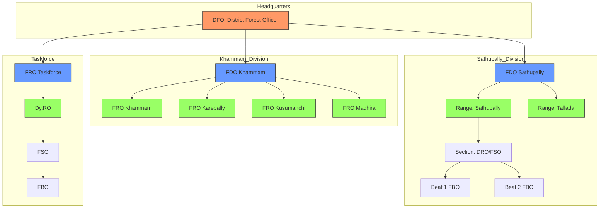
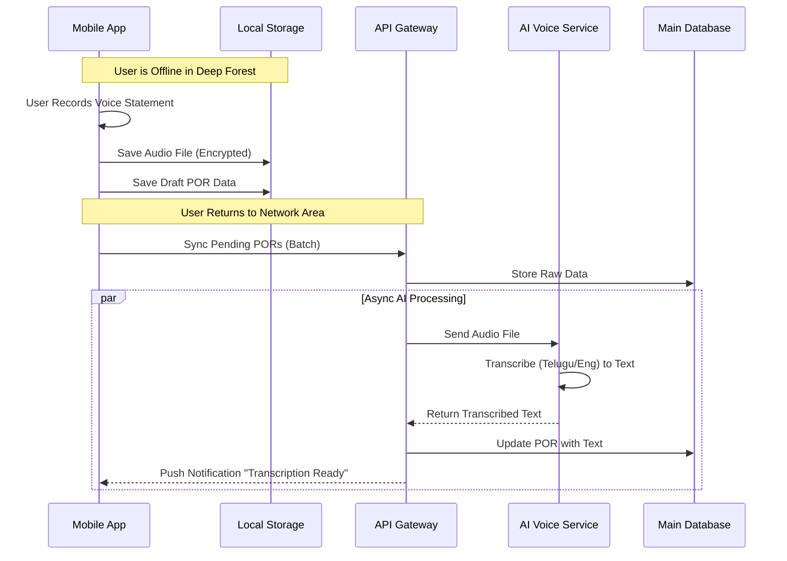
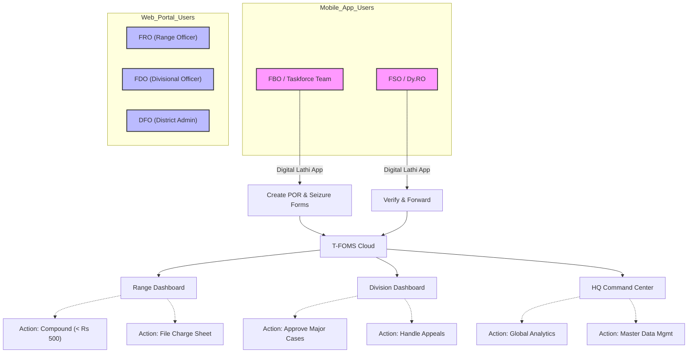

# T-FOMS Visual Diagrams

Based on the [Project Plan](PROJECT_PLAN.md) and [Organizational Hierarchy](handwritten_hierarchy.md), here are the visual representations of the system's use cases and process flows.

## 1. System Use Case Diagram

This diagram outlines the primary actors and their interactions with the T-FOMS system.

```mermaid
graph TD
    %% Actor Definitions
    FieldStaff["FBO (Field Staff)"]
    Investigator["DyRO / FSO"]
    FRO["FRO"]
    FDO["FDO"]
    DFO["DFO"]
    Taskforce["Taskforce"]

    %% Use Case Definitions
    UC1["Create POR (Form A)"]
    UC2["Generate Seizure Form (Form B)"]
    UC3["Generate Safe Custody (Form C)"]
    UC4["Record Witness/Pancha Details"]

    UC5["Investigation (Statements/Evidence)"]
    UC6["Issue Notices (41A CrPC)"]
    UC7["Generate Charge Sheet (Non-Wildlife)"]

    UC8["Verify POR & Forms"]
    UC9["Record Confession"]
    UC10["Issue Compounding Order (Form E)"]
    UC11["Generate Compounding Charge Sheet (Form F)"]

    UC12["Issue Prosecution Orders"]
    UC13["Universal POR Oversight"]
    UC14["Approve Major Compounding"]

    %% Relationships
    FieldStaff --> UC1
    FieldStaff --> UC2
    FieldStaff --> UC3
    FieldStaff --> UC4

    Investigator --> UC5
    Investigator --> UC6
    Investigator --> UC7

    FRO --> UC8
    FRO --> UC9
    FRO --> UC10
    FRO --> UC11

    FDO --> UC12
    FDO --> UC13
    FDO --> UC14

    DFO --> UC13
    DFO --> UC14

    %% Integrations
    UC1 -.->|trigger| UC8
    UC5 -.->|support| UC7
```

## 2. Offense Reporting Flow (Mobile App)

The sequence of actions for Field Staff using the "Digital Lathi" mobile application.

## 3. Case Disposal Decision Workflow (Rules 1969)

This flow illustrates the logic for determining whether a case undergoes Compounding or Prosecution, adhering to the authority hierarchies.

## 4. Organizational Hierarchy & Data Visibility

Visualizing how data flows through the specific divisions identified in the hierarchy.

## 5. High-Level Entity Relationship Diagram (ERD)

This diagram models the core data entities and their relationships within the T-FOMS backend.

## 6. Offline Sync & Voice-to-Text Sequence

Sequence of events for the "Digital Lathi" app operating in offline mode and syncing later.

## 7. User Roles & Access Matrix

Based on the [Organizational Hierarchy](handwritten_hierarchy.md), this section defines "Who uses What" and their specific permissions in the system.

### A. Role Capability Breakdown

| Hierarchy Level       | Roles                                            | Primary Interface                   | Key Capabilities & Views                                                                                                                                                                                  | Data Visibility Scope                                                                                                    |
| :-------------------- | :----------------------------------------------- | :---------------------------------- | :-------------------------------------------------------------------------------------------------------------------------------------------------------------------------------------------------------- | :----------------------------------------------------------------------------------------------------------------------- |
| **1. Field Level**    | **FBO** (Beat Officer)``**Taskforce Constable**  | **Mobile App**``("Digital Lathi")   | •**Create POR**: Issue **Form A** (POR), **Form B** (Seizure), **Form C** (Safe Custody).`• **Witness**: Record Pancha witness description.`• **Offline Mode**: Local store & forward.                    | •**Restricted**: Can only see reports created by themselves.``• Cannot edit after submission.                            |
| **2. Section Level**  | **FSO** (Section Officer)``**Dy.RO** (Taskforce) | **Mobile App**``+ Limited Web       | •**Investigate**: Collect 161 Statements, Expert Opinions, Call Analysis.`• **Legal**: Issue **63B Cert** (Evidence) & **35 BNSS (41A CrPC)** Notice.`• **Charge Sheet**: Prepare for Non-Wildlife cases. | •**Universal Visibility**: Instant view of ALL PORs in their jurisdiction.``• View all reports within their Section.     |
| **3. Range Level**    | **FRO** (Range Officer)``**FRO Taskforce**       | **Web Portal**``(Range Dashboard)   | •**Compounding**: Issue Order (Form E) & **Form F** (Compounding Charge Sheet).`• **Non-Compoundable**: Forward to FDO for Prosecution Orders.`• **Confession**: Record accused confession.               | •**Universal Visibility**: Instant view of ALL PORs in their Range.``• Full access to all Sections & Beats.              |
| **4. Division Level** | **FDO** (Divisional Officer)                     | **Web Portal**``(Division Admin)    | •**Prosecution**: Issue Prosecution Orders.`• **Major Approvals**: Compounding for high value (> ₹500) cases.`• **Oversight**: Monitor FRO performance.                                                   | •**Universal Visibility**: Instant view of ALL PORs in their Division.``• Full access to Khammam OR Sathupally Division. |
| **5. District Level** | **DFO** (District Officer)                       | **Web Portal**``(HQ Command Center) | •**Strategic View**: GIS Heatmaps of entire district.`• **Taskforce Control**: Direct tasks to Taskforce teams.`• **Admin**: Master data (Species lists, Fine rates).                                     | •**Global Access**: Full visibility of Khammam Division, Sathupally Division, and Taskforce.                             |

### B. Access & Logic Map

Visualizing how different roles interact with the system interfaces.

