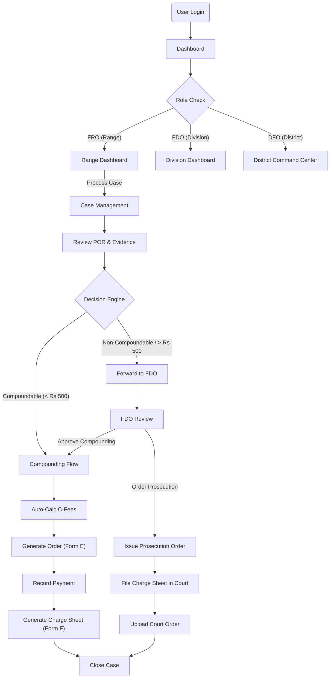

# T-FOMS Web Portal ("The HQ") Design

Based on the [Project Plan](PROJECT_PLAN.md) and [Visual Diagrams](visual_diagrams.md), this document details the design, flows, and interface specifications for the T-FOMS Web Portal.

## 1. Product Flow (High Level)

The Web Portal serves as the "Command Center" for checking, validating, and legally processing the offenses reported by the field staff. It automates the complex decision matrix of the _AP Forest Offences Rules, 1969_.

## 2. Roles & Functions (Web Specific)

The web portal is designed for administrative and legal processing.

| Role                              | Primary Functions in Web Portal                                                                                                                                                                                                                                                                                |
| :-------------------------------- | :------------------------------------------------------------------------------------------------------------------------------------------------------------------------------------------------------------------------------------------------------------------------------------------------------------- |
| **FRO (Range Officer)**           | • **Case Review**: Validate PORs submitted by FBO/FSO. • **Compounding**: Issue Form E for minor offenses (< Rs 500). • **Charge Sheet**: Generate Form F (Compounding Charge Sheet). • **Escalation**: Forward major cases to FDO. • **Confession**: Record/Upload accused confession statements. |
| **FDO (Divisional Officer)**      | • **Approvals**: Approve compounding for high-value cases or special categories. • **Prosecution**: Issue official Prosecution Orders for court cases. • **Appeals**: Handle appeals against compounding orders. • **Oversight**: Monitor performance of Ranges and Sections.                         |
| **DFO (District Forest Officer)** | • **Strategic View**: GIS Heatmaps and District-wide analytics. • **Taskforce**: Direct taskforce raids and monitor their outcomes. • **Master Data**: Manage species lists, fine rates, and user roles.                                                                                                 |
| **Admin**                         | • **User Mgmt**: Create/Deactivate users, assign hierarchy (Beat -> Section -> Range). • **System Config**: Audit logs, backup settings.                                                                                                                                                                    |

## 3. UI/UX Screen Visualizations & Views

### A. Dashboard ("The Eagle Eye")

- **Visual**: High-density dashboard with map integration.
- **Key Metrics (Top Bar)**:
  - Total Offenses (Today/Month).
  - Total Seizure Value.
  - Pending Compounding Orders.
  - Open Court Cases.
- **GIS Map**:
  - Plots all recent PORs as pins.
  - Color-coded pins: 🔴 Critical (Teak/Sanders), 🟡 Minor, 🟢 Closed.
  - Heatmap layer for "Hotspots".
- **Action List**: "Tasks Pending Your Action" (e.g., Approve Form E, Issue Prosecution Order).

### B. Case Management (Kanban/List View)

- **Visual**: Split view. Left side list/Kanban, Right side preview.
- **Columns (Kanban)**:
  - New POR (Inbox)
  - Under Investigation
  - Pending Approval (FDO/DFO)
  - Prosecution Started
  - Closed
- **Filters**: By Range, By Offense Type (Wildlife vs Timber), By Date.

### C. Case Detail Workspace (The "Legal Desk")

This is the core working screen for FROs/FDOs.

- **Header**: Case ID (2024/KMM/001), Current Status, Age (e.g., "Open for 12 days").
- **Tab 1: Timeline & Evidence**
  - Timeline vertical list: "POR Created" -> "Seizure Recorded" -> "Statement Added".
  - **Media Gallery**: View photos, Listen to voice recordings (with transcriptions).
  - **Map View**: Exact location of offense and seizure.
- **Tab 2: Legal Forms (The "Paperwork")**
  - List of generated forms: Form A, B, C.
  - **Action**: "Generate New Form" -> Select Form D/E/F.
  - **Preview**: PDF preview on screen.
- **Tab 3: Decision Engine**
  - **Wizard**:
    1.  Verify Seizure Value (Auto-sum items).
    2.  Check History (Is Accused a Repeat Offender?).
    3.  **System Recommendation**: "Recommended for Prosecution (Value > 500)" or "Eligible for Compounding".
  - **Action Buttons**: "Issue Compounding Order", "Forward to FDO", "File for Prosecution".

### D. Master Data Management (Admin)

- **Species Manager**:
  - Add/Edit Species (e.g., "Teak", "Rosewood").
  - Set Base Rates (CFT value).
  - Set Classification (Reserved/Protected).
- **User Hierarchy**:
  - Drag-and-drop tree view to move a Beat under a different Section.

## 4. Detailed UI Flows

### Flow 1: Compounding a Minor Offense (FRO Level)

1.  **Alert**: Dashboard shows "New POR in Encroachment".
2.  **Review**: FRO opens case, checks photos and FBO report.
3.  **Validation**: FRO accepts the POR. Status -> "Under Investigation".
4.  **Decision**:
    - FRO clicks "Process Case".
    - System checks: Value = Rs 400. Not Sandalwood. Accused = First time.
    - System Result: "Eligible for Compounding".
5.  **Action**: FRO clicks "Generate Form E".
6.  **Input**: Enters Compounding Fee (Standard + Additional).
7.  **Sign**: Uses Digital Signature (Class 2/3 or eSign) to sign Form E.
8.  **Output**: PDF generated and sent to Mobile App of FSO to serve to accused.
9.  **Closure**: Once payment is marked "Received", FRO clicks "Generate Form F". Case Closed.

### Flow 2: Prosecution for Major Offense (FDO Level)

1.  **Escalation**: FRO marks case "Non-Compoundable" (e.g., Assault on officer) and forwards to FDO.
2.  **Notification**: FDO gets email/SMS + Dashboard alert.
3.  **Review**: FDO reviews evidence.
4.  **Action**: FDO clicks "Issue Prosecution Order".
5.  **Document**: System generates standard Legal Order template, filled with Case/Accused details.
6.  **Handover**: Case moves to "Prosecution Started". FRO gets alert to file Charge Sheet in Court.

## 5. View Actions Summary

| View               | User Actions                             | System Actions                               |
| :----------------- | :--------------------------------------- | :------------------------------------------- |
| **Dashboard**      | Drill down into Ranges, Click Filters    | Aggregates real-time stats, renders Hitmaps  |
| **Case Kanban**    | Drag-and-drop status change              | Updates Order Status, triggers notifications |
| **Case Detail**    | Play Audio, View Map, Edit Transcription | Streams media, Reverse Geocodes location     |
| **Form Generator** | Select Template, Input Values, Sign      | Merges data into PDF, applies QR Code        |
| **Search**         | Search by Name, Aadhar, Vehicle No.      | Fuzzy search across entire database          |
